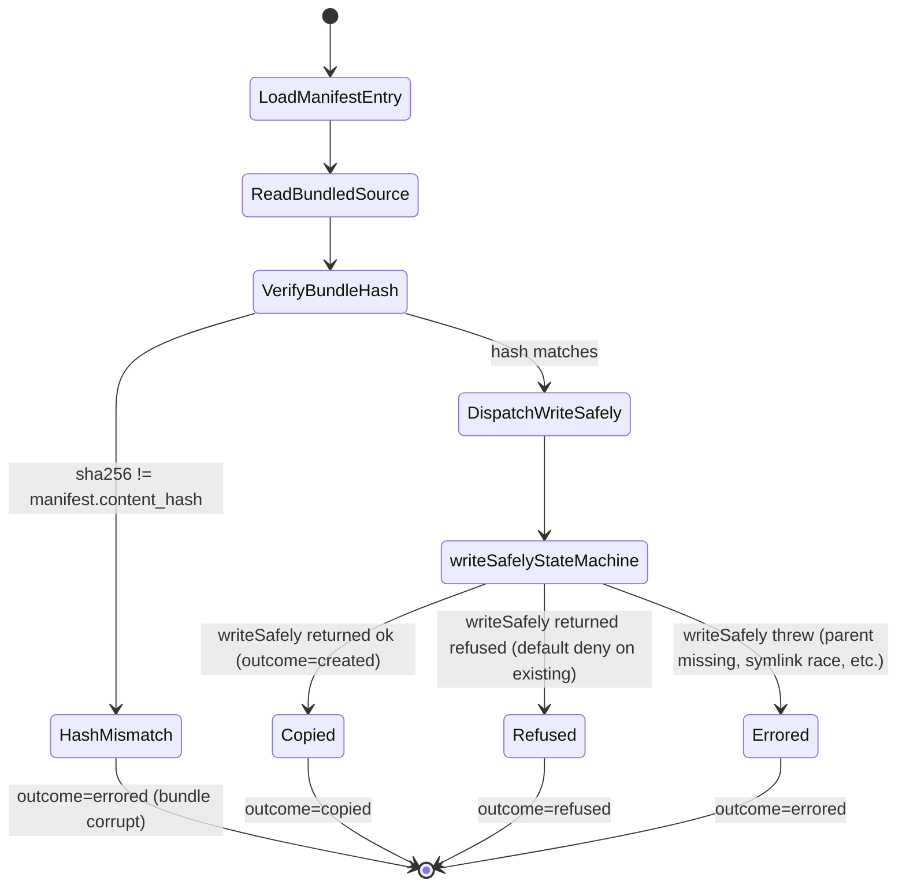
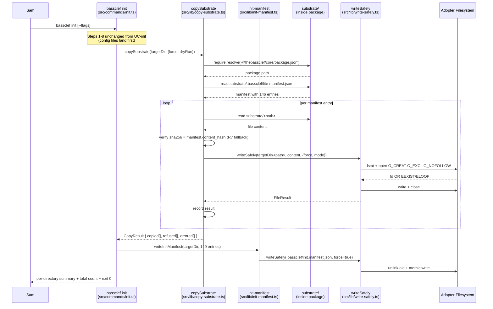
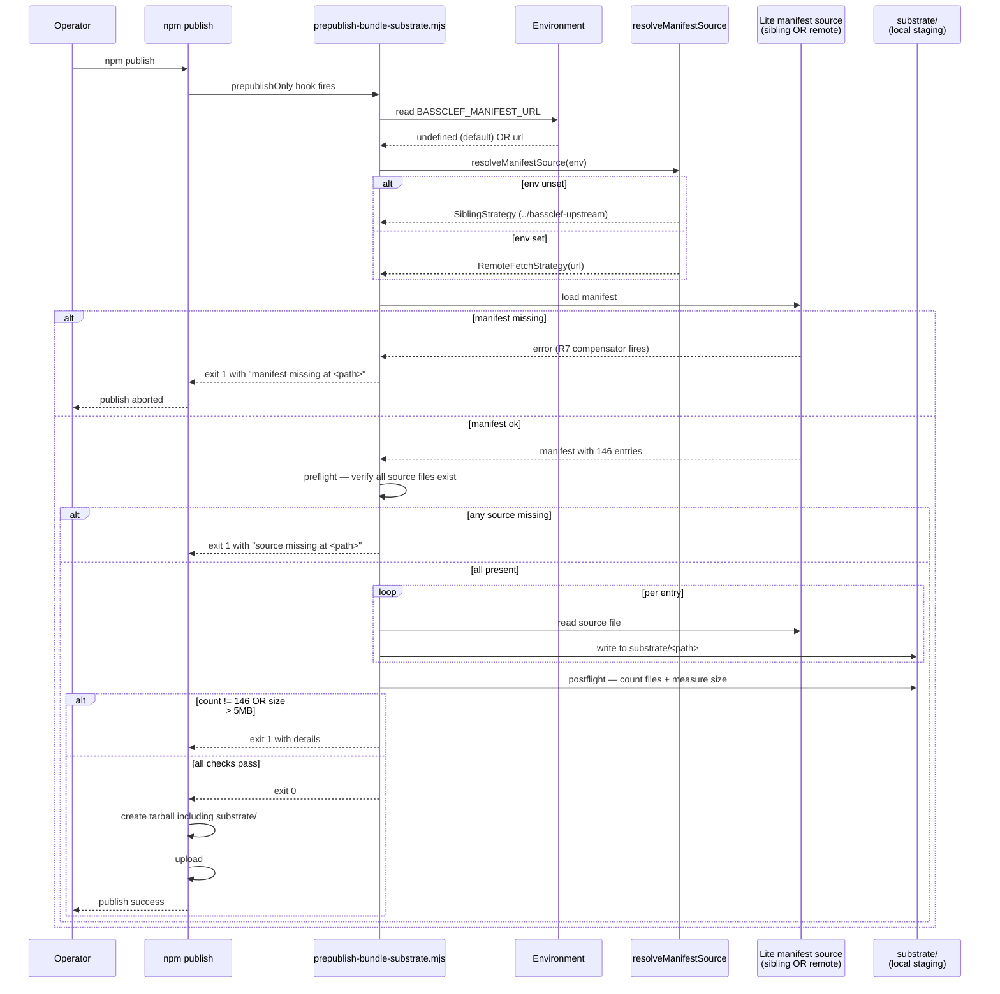

# npm-lite substrate bundling decomposition

Step 2 of goal 2026-08-28d. Drives the code Step 4 tests + Steps 5-6 source ship. Every module below carries a `@pattern` annotation OR a note that names the catalog gap. Every module ties to a risk ledger row via `@risk: R#`.

## Sources read

- `docs/iteration-bets/2026-08-28d-npm-lite-substrate-bundling.md` — goal doc; 9-step table; primary lenses ousterhout + parnas
- `docs/use-cases/UC-npm-lite-substrate-bundling.md` — 16-step main scenario + 11 extensions; special requirements pin design constraints to ledger rows
- `docs/pre-mortem-mappings/2026-08-28-npm-lite-bundling.md` — risk ledger v1; 9 rows across 3 lenses
- `docs/decompositions/wu-2-init.md` — sibling decomposition; source for local convention + `writeSafely` module shape (§ Control objects)
- `docs/decompositions/wu-3-sync.md` (not read this session; goal doc L37 references existing sync classifier)
- `../bassclef-upstream/patterns/code/gof/adapter.md` — pattern for manifest interface
- `../bassclef-upstream/patterns/code/gof/strategy.md` — pattern for publish-time manifest discovery
- `../bassclef-upstream/patterns/code/gof/factory-method.md` — pattern for FilePlan construction
- `../bassclef-upstream/patterns/code/fowler-poeaa/repository.md` — pattern for manifest as read-side interface
- `../bassclef-upstream/lite-manifest.json` header — 146 entries; manifest_version 1.2.19

## Q0 — Publish-time manifest discovery (design decision)

The prepublish script needs the sibling manifest at `bassclef-upstream/lite-manifest.json`. Two candidate paths:

**Option (i) — sibling checkout on operator machine:**
- Path: `../bassclef-upstream/lite-manifest.json` (relative to bassclef-cli root)
- Preconditions: operator has bassclef-upstream checked out as sibling directory
- Fail mode: script exits nonzero with `manifest missing at expected path` (R7 compensator)
- Confidence: matches operator machine layout observed at whereami L2 (tier: lite adopter running from `~/src/sunj-labs/bassclef-cli/` alongside `~/src/sunj-labs/bassclef-upstream/`)

**Option (ii) — GitHub raw fetch at publish time:**
- Path: `https://raw.githubusercontent.com/sunj-labs/bassclef-upstream/main/lite-manifest.json`
- Preconditions: network at publish; upstream `main` branch carries a current manifest
- Fail mode: network error OR upstream not tagged at expected shape
- Confidence: decouples from local layout; introduces network dependency at publish + a tacit dependency on upstream branch state

**Recommended path — hybrid via Strategy pattern:**

`resolveManifestSource()` picks a strategy at runtime:

1. Default — **sibling checkout** (Option i). Simple, offline-safe, fails fast when missing.
2. Override via env — `BASSCLEF_MANIFEST_URL=<raw-url>` opts into **remote fetch** (Option ii). Same fail-fast shape; different source.

Alternatives ruled out per Peirce:
- (a) Auto-fallback (try sibling → fall back to fetch) — hides failure mode from maintainer; obscures which source landed in the tarball; Nygard bulkhead violation
- (b) Fetch-only — requires network at every publish; brittle
- (c) Sibling-only — no escape hatch if operator lacks checkout (relevant for CI or fresh machine)

Two strategies. Explicit selection via env. Fail-fast per strategy. Ships Option i as default this goal; Option ii sits behind env var for CI + fresh-machine cases.

**@pattern** `../bassclef-upstream/patterns/code/gof/strategy.md` — the two source-discovery paths are Strategy instances behind a common interface.

## Boundary objects — what the CLI + adopter see

| Boundary | Shape | Notes |
|---|---|---|
| `bassclef init` command line | Same argv shape as UC-init | UC-npm-lite-substrate-bundling extends the copy step |
| `bassclef sync` command line | Same argv shape as UC-sync | Extended to walk 149-file manifest |
| Init output — per-directory summary | `hooks: 25 files copied`, `skills: 47 files copied`, etc. | Sam sees counts, not file lists (Cooper — not a dancing bear) |
| Failure output — per-file | `<action>   <path>   <reason>` | Same shape as UC-init (Cooper — trust signal + actionable) |
| `.bassclef/init.manifest.json` on disk | JSON — schema_version + entries[] with `{path, template_version, content_hash}` per file | Extended from 3 entries to 149 entries |
| `substrate/` inside the npm package | 146 files under paths matching the source tree layout | Sam never sees this directly; `require.resolve` finds it at runtime |

## Entity objects — domain state

| Entity | Where it lives | Read-only or written by Step 6? |
|---|---|---|
| Lite manifest (`bassclef-upstream/lite-manifest.json`) | Sibling checkout OR remote URL | Read at prepublish only |
| `substrate/` tree inside npm package | Compiled into the tarball by prepublish | Read at `bassclef init` time |
| Init manifest (`.bassclef/init.manifest.json`) | Adopter's project dir | Written by `bassclef init`; read by `bassclef sync` |
| Target substrate files under `.claude/` | Adopter's project dir | Written by `bassclef init` (default deny on existing) |
| Config files (`.claude/settings.json`, `substrate.config.md`) | Adopter's project dir | Existing UC-init behavior (unchanged) |

## Control objects — the code that runs

### `scripts/prepublish-bundle-substrate.mjs` (Step 5)

@risk: R2 (no execSync — pure Node), R7 (fail-fast on missing manifest), R9 (size check)
@pattern `../bassclef-upstream/patterns/code/gof/strategy.md` — manifest source discovery

Reads the lite manifest via the chosen Strategy. Copies each entry from source to `substrate/` inside the package. Verifies file count matches manifest count. Verifies total size below 5MB. Exits nonzero on any failure with a specific message.

- ≤ 100 lines
- Pure Node (no `execSync`, no shell-outs) per R2
- Reads manifest strategy from env (`BASSCLEF_MANIFEST_URL` opts into remote fetch)
- Preflight — verify all 146 source files exist BEFORE copying starts (R7 compensator)
- Postflight — verify `substrate/` file count = 146; total size < 5MB (R7 + R9)
- Dispatched via `package.json` `prepublishOnly` hook

### `src/lib/copy-substrate.ts` (Step 6)

@risk: R1 (one public method), R5 (consumer walks manifest, not filesystem)
@pattern (catalog gap — Facade would fit; noted in § Substrate catalog gaps below)

The public method is `copySubstrate(targetDir: string, options: CopyOptions): Promise<CopyResult>`. Everything else is private:

- Locate bundled `substrate/` via `require.resolve('@thebassclef/core/package.json')` + relative path
- Load bundled init manifest at `substrate/.bassclef/lite-manifest.json`
- Walk manifest entries; for each: call `writeSafely` with content + hash verification
- Return `CopyResult { copied: string[], refused: string[], errored: string[] }`

- ≤ 120 lines
- ONE public export (R1 compensator; `grep -c "^export" src/lib/copy-substrate.ts` = 1)
- No direct `fs.writeFileSync` (R3 compensator — routes through `writeSafely`)
- No literal `'substrate/'` string outside this file (R5 compensator)

### `src/lib/init-manifest.ts` (Step 6)

@risk: R4 (typed module wrapping raw JSON reads)
@pattern `../bassclef-upstream/patterns/code/gof/adapter.md` — wraps raw JSON into typed interface
@pattern `../bassclef-upstream/patterns/code/fowler-poeaa/repository.md` — provides read/write access to init manifest as a collection

Wraps read + write of `.bassclef/init.manifest.json`. Returns typed objects; hides JSON parsing behind the interface.

Public API:
- `readInitManifest(targetDir: string): InitManifest`
- `writeInitManifest(targetDir: string, manifest: InitManifest): void`
- `type InitManifest = { schema_version: string, entries: InitManifestEntry[] }`
- `type InitManifestEntry = { path: string, template_version: string, content_hash: string }`
- `detectLegacyManifest(manifest: InitManifest): boolean` — R8 migration path detection

- ≤ 80 lines
- No `JSON.parse` outside this file (R4 compensator; `grep -rc "JSON.parse.*manifest" src/ --exclude-dir=lib` = 0)
- Migration detection returns true when `schema_version < "0.1.0"` OR entries count = 3

### `src/lib/write-safely.ts` (Step 6 — extracted from init.ts)

@risk: R3 (shared helper both init + copy-substrate call)

Extracted from the existing `writeSafely()` in `src/commands/init.ts` (UC-init step 8). No behavior change; same atomic-open contract per ADR-002.

- Preserves existing safety envelope: `O_CREAT | O_EXCL | O_NOFOLLOW`
- Symlink refusal unconditional (even under `--force`)
- Only `writeFileSync` call in the codebase after extraction (R3 verification: `grep -rc "writeFileSync" src/` = 1)

### `src/lib/paths.ts` (Step 6)

@risk: R6 (one source of truth for path constants)

Two constants:
```typescript
export const SUBSTRATE_ROOT = 'substrate';
export const CLAUDE_TARGET_ROOT = '.claude';
```

Every path derived from these. R6 verification: `grep -rE "\.claude/(hooks|skills|rules)" src/ --exclude=src/lib/paths.ts` = 0.

### `src/commands/init.ts` (Step 6 — amended)

@risk: R3 (routes through extracted `writeSafely` helper)

Amendment at UC-init step 9 — after config files land, dispatch `copySubstrate(targetDir, options)`. Report per-directory summary; sum into total count.

- Delta: ~20 lines added
- No behavior change for the existing 3-file init path
- Copy dispatch happens only if `substrate/` present in package (defends against a partial install)

### `src/commands/sync.ts` (Step 6 — amended)

@risk: R8 (adopter migration from 0.0.2 to 0.1.0)

Amendment: sync reads manifest via `readInitManifest`. If `detectLegacyManifest()` returns true, dispatch migration path — add 146 new files (default deny on existing), rewrite manifest to new shape. Report count added + count preserved.

- Delta: ~40 lines added
- Uses existing classifier for the 3 legacy files (unchanged behavior)
- Uses `copySubstrate` for the 146 new files (deep reuse; not a fork of the classifier)

## State diagram — per-file copy outcome (Step 6 copy-substrate)

Every entry in the bundled manifest runs the same state machine. `writeSafely` is the single audited mutation point (R3 compensator).



`writeSafelyStateMachine` reuses the state machine at `docs/decompositions/wu-2-init.md` § State diagram (§L156-181). No new state; just new caller.

## Sequence diagram — `bassclef init` with substrate copy (Step 6)



Traceability: every module in this diagram maps to a file in § Control objects; every write goes through `writeSafely` (R3 compensator).

## Sequence diagram — `npm publish` with prepublish bundling (Step 5)



R7 compensator fires at three checkpoints: strategy resolution failure, preflight file-existence check, postflight count check.

## Test list first (Beck) — Tier 0 for Step 4

Full list drives Step 4 RED implementation. Tests written before source per `.claude/rules/test-list-discipline.md`. Every test carries `// @risk: R#` comment.

### `tests/harness/prepublish-bundle.test.ts` (Step 4a)

- [ ] `// @risk: R7` — sibling manifest missing → exit nonzero with "manifest missing" in stderr
- [ ] `// @risk: R7` — sibling manifest present + one source file missing → exit nonzero with specific missing path
- [ ] `// @risk: R2` — script has zero execSync / spawn calls (`grep -cE "execSync|spawn" scripts/prepublish-bundle-substrate.mjs` = 0)
- [ ] happy path — sibling manifest present + all 146 source files present → exit 0; `substrate/` populated with 146 files
- [ ] `// @risk: R9` — postflight enforces size < 5MB; artificial fixture exceeding 5MB triggers exit nonzero
- [ ] postflight enforces file count = manifest entry count; mismatch triggers exit nonzero
- [ ] `// @risk: R7` strategy — env `BASSCLEF_MANIFEST_URL` set → RemoteFetchStrategy loads; env unset → SiblingStrategy loads
- [ ] every copied file's SHA256 matches source SHA256 (verify hash preserved through copy)

### `tests/harness/copy-substrate.test.ts` (Step 4b)

- [ ] `// @risk: R1` — `src/lib/copy-substrate.ts` has exactly one export (`grep -c "^export" src/lib/copy-substrate.ts` = 1)
- [ ] happy path — fresh temp dir + 3-file fixture manifest → all 3 files copied; result reports `copied: 3`
- [ ] `// @risk: R3` — copySubstrate does not call `fs.writeFileSync` directly (`grep -rc "writeFileSync" src/lib/copy-substrate.ts` = 0; only `writeSafely`)
- [ ] `// @risk: R5` — no literal `'substrate/'` string in consumer code (`grep -rc "'substrate/" src/commands/` = 0)
- [ ] target file already exists → refused; result reports `refused: 1`; existing content preserved
- [ ] `--force` flag → existing file overwritten; result reports `copied: 1`
- [ ] `--dry-run` → nothing written; result reports `wouldCopy: N`
- [ ] `// @risk: R7 fallback` — bundle source hash differs from manifest entry hash → errored; specific file named in error
- [ ] symlink at target path → refused unconditionally (even with `--force`); result reports `errored: 1` (symlink)

### `tests/harness/init-manifest.test.ts` (Step 4c)

- [ ] `// @risk: R4` — `src/lib/init-manifest.ts` wraps JSON parse; no `JSON.parse.*manifest` outside module (`grep -rc "JSON.parse.*manifest" src/ --exclude-dir=lib` = 0)
- [ ] `readInitManifest` on missing file → returns null (not throws)
- [ ] `readInitManifest` on legacy 3-entry manifest → returns typed InitManifest object
- [ ] `writeInitManifest` round-trips a 149-entry object without data loss
- [ ] `detectLegacyManifest` returns true for 3-entry manifest; false for 149-entry manifest

### `tests/harness/sync-migration.test.ts` (Step 4d, for R8)

- [ ] `// @risk: R8` — fresh dir + `bassclef init` at v0.0.2 fixture → 3-file manifest; then `bassclef sync` at v0.1.0 fixture → detects legacy; adds 146 files; rewrites manifest to 149 entries; existing 3 config files unchanged
- [ ] adopter edited one config file post-init → migration preserves edit (default deny on existing)
- [ ] migration reports counts: `146 files added; 3 files preserved; 0 errored`

### `tests/harness/paths.test.ts` (Step 4e, for R6)

- [ ] `SUBSTRATE_ROOT` and `CLAUDE_TARGET_ROOT` constants are single-source
- [ ] path literals outside `src/lib/paths.ts` = 0 (`grep -rE "\.claude/(hooks|skills|rules)" src/ --exclude=src/lib/paths.ts` = 0)

**Test count summary:** 24 Tier 0 tests. Each carries `// @risk: R#` per bassclef-upstream#1420 build wiring contract. Signoff at Step 7 runs grep audit against ledger.

## Substrate catalog gaps identified

Three patterns fit the design shape but are absent from `bassclef-upstream/patterns/code/`. Per `.claude/rules/pattern-annotation.md` — don't annotate code without a catalog entry. Follow-on candidates:

| Pattern | Where it would fit | Catalog gap |
|---|---|---|
| **Facade** (GoF) | `copy-substrate.ts` public method hides walk + verify + write behind one call | `patterns/code/gof/facade.md` missing |
| **Circuit Breaker** (Nygard) | prepublish fail-fast — verify manifest + count + size BEFORE bundling starts | `patterns/code/nygard/` directory missing entirely |
| **Template Method** (GoF) | per-file copy flow — same shape whether copying from sibling or bundled substrate | `patterns/code/gof/template-method.md` missing (iteration i also caught this gap per whereami L26) |

Follow-on — file at bassclef-upstream via `/agent-research-spawn` after this goal closes. Pattern annotations added retroactively at that point.

## Open questions

**Q1 — Init manifest schema version.** Existing 0.0.2 manifest carries `schema_version` field? Read at Step 3.5 (ledger v2) OR test-first at Step 4c and cure by writing a fixture. Recommendation: assume field exists per convention; if missing, migration detection falls back to entry count = 3.

**Q2 — Prepublish script location.** `scripts/` is the convention per goal doc L52. Node ESM (`.mjs`) or TypeScript compiled at build (`.ts` → `dist/scripts/`)? Recommendation: `.mjs` — no compile step needed; simpler for prepublish; matches how existing `scripts/bump-version.mjs` ships.

**Q3 — Init dry-run for copy-substrate.** UC extension 4a says dry-run prints "would copy: N files". Do we print per-directory count OR per-file lines like `writeSafely` currently does? Recommendation: per-directory summary (matches Cooper — Sam sees the shape, not every file). If operator wants per-file lines, `--verbose` flag opts in.

**Q4 — Adopter edit detection for existing config files during migration.** R8 migration path preserves the 3 config files. Do we compute their hashes at migration time and record in the new 149-entry manifest? Recommendation: yes — otherwise sync classifier loses ground on those 3 files. Small extra work; big correctness win.

## What Step 6 must produce (revised file list)

- [ ] `src/lib/paths.ts` — constants (new)
- [ ] `src/lib/write-safely.ts` — extracted from init.ts (new file; init.ts imports it)
- [ ] `src/lib/init-manifest.ts` — typed manifest module (new)
- [ ] `src/lib/copy-substrate.ts` — copy public method (new)
- [ ] `src/commands/init.ts` — amended to dispatch copySubstrate (delta ~20 lines)
- [ ] `src/commands/sync.ts` — amended with migration path (delta ~40 lines)
- [ ] `docs/migrations/0.1.0.md` — migration doc (new)
- [ ] `docs/use-cases/UC-init.md` — amendment noting the extension (delta ~5 lines)
- [ ] `docs/use-cases/UC-sync.md` — amendment noting the migration path (delta ~5 lines)

## What Step 5 must produce

- [ ] `scripts/prepublish-bundle-substrate.mjs` (new)
- [ ] `package.json` — `files:` adds `substrate/**`; `scripts.prepublishOnly` runs the bundle script (delta ~2 lines)
- [ ] `.gitignore` — adds `substrate/` (delta ~1 line; substrate populated at publish, never committed)

## What Step 4 must produce

- [ ] `tests/harness/prepublish-bundle.test.ts` (8 tests)
- [ ] `tests/harness/copy-substrate.test.ts` (9 tests)
- [ ] `tests/harness/init-manifest.test.ts` (5 tests)
- [ ] `tests/harness/sync-migration.test.ts` (3 tests)
- [ ] `tests/harness/paths.test.ts` (2 tests)
- [ ] Fixture: `tests/fixtures/lite-manifest-mini.json` — 3-entry manifest for copy-substrate tests
- [ ] Fixture: `tests/fixtures/v0.0.2-init-manifest.json` — legacy shape for migration tests

Total: 27 tests + 2 fixtures. RED first (Beck). Green after Step 5-6 lands.

## Traceability summary

| Design decision | Where recorded | Ledger row |
|---|---|---|
| Strategy for manifest source discovery | Q0 above + Step 5 code | R7 (fail-fast on missing) |
| One public copySubstrate method | § Control objects — copy-substrate.ts | R1 |
| Pure-Node prepublish script | § Control objects — prepublish script | R2 |
| Shared writeSafely helper | § Control objects — write-safely.ts | R3 |
| Typed init-manifest module (Adapter + Repository) | § Control objects — init-manifest.ts | R4 |
| Consumer walks manifest not filesystem | § Control objects — copy-substrate.ts | R5 |
| Constants module for paths | § Control objects — paths.ts | R6 |
| Adopter migration path via legacy detection | § Control objects — sync.ts | R8 |
| Package size check in prepublish + CI | Test list — prepublish-bundle.test.ts | R9 |

Every ledger row (R1-R9) has at least one design decision + at least one Tier 0 test. Signoff at Step 7 verifies the round-trip.

## Composes with

- ADR-005 — parent split (@thebassclef/core is the lite vehicle)
- ADR-007 (Step 3 output) — pins Shape A layered under Shape D
- UC-npm-lite-substrate-bundling — user goal this decomposition realizes
- Risk ledger — v2 at Step 3.5 refines file paths + verification per row after this decomposition + ADR-007 land
- `docs/decompositions/wu-2-init.md` — sibling; extracted writeSafely comes from there; per-file state machine reused verbatim
- `bassclef-upstream/standards/lite-manifest-assembly.md` v1.2 — definitive contract for what's in the manifest
