# bassclef migrate subcommand decomposition

Step 2 of goal 2026-08-30a. Drives the code — Step 3 ADR + risk ledger; Step 4 tests; Steps 5-6 source. Every module carries a `@pattern` annotation OR a note that names the catalog gap. Every module ties to a risk row via provisional `@risk: R#` labels; Step 3 pins the ledger and refines.

## Sources read

- `docs/iteration-bets/2026-08-30a-npm-lite-migrate-subcommand.md` — goal doc; 8-step table; Linus + Ousterhout primary lens
- `docs/use-cases/UC-migrate.md` (this session Step 1) — 10-step main scenario + 12 extensions; Special requirements pin design constraints
- `docs/decompositions/2026-08-28-npm-lite-bundling.md` — sister decomp; source for module conventions + writeSafely + manifest-io shape; parent decomp for the bundled manifest scope-e reads
- `docs/decompositions/wu-2-init.md` — init decomposition; Path B (migrate → init dispatch) reads this for reuse shape
- `docs/decompositions/wu-3-sync.md` — sync decomposition; Path A borrows classifier semantics
- `src/lib/manifest-io.ts` (existing) — `detectLegacyManifest`, `readManifest`, `writeManifest`, `Manifest` type all present per scope-b1 c84fa84
- `src/lib/write-safely.ts` (existing) — atomic-open envelope + symlink refusal
- `src/commands/init.ts` (existing) — Path B dispatch target
- `../bassclef-upstream/patterns/code/gof/strategy.md` — pattern for Path A / Path B branch
- `../bassclef-upstream/patterns/code/gof/adapter.md` — pattern for the prompt module wrapping readline
- `../bassclef-upstream/patterns/code/fowler-poeaa/repository.md` — pattern for manifest-io as read + write surface
- `package.json` L52 (`engines.node`) — Node ≥ 20 confirms readline/promises available (Node built-in; no new dep)

## Q0 — Interactive prompt design decision

Migrate is Sam's deliberate upgrade command (Cooper lens; goal doc L91). Interactive prompt shows her the intended shape ("146 to add; 3 to preserve; 0 to skip") before any write fires. Three candidate designs:

**Option (i) — Node built-in `readline/promises`:**
- Path: `import { createInterface } from 'node:readline/promises'`
- Preconditions: TTY OR non-interactive fallback (auto-abort with message)
- Fail mode: no TTY → refuse with "run with `--yes` for non-interactive mode"
- Confidence: matches tech stack — no new dep; `configs.jsonc` L51 pins Node ≥ 20 which ships readline/promises stable

**Option (ii) — small vetted library (`enquirer`, `prompts`):**
- Path: `npm install prompts` (or similar)
- Preconditions: dep added to package.json + lockfile
- Fail mode: library-owned; less control over exact output shape
- Confidence: adds a runtime dep to a package whose whole story is "npm install and go"; violates the minimal-dep discipline scope-b1 established

**Option (iii) — inline readline (no promises wrapper):**
- Path: `import readline from 'node:readline'` + hand-rolled promise wrapper
- Preconditions: none extra
- Fail mode: same as Option (i) minus the built-in promise ergonomics
- Confidence: reinvents what `readline/promises` gives for free

**Recommended path — Option (i) via a tiny prompt module:**

`src/lib/prompt.ts` exports one function:

```typescript
export async function confirm(question: string, opts?: { defaultNo?: boolean, ttyOverride?: 'yes' | 'no' }): Promise<boolean>
```

Wraps `readline/promises` with default-no + `--yes` override injectable at test time. Ousterhout deep module — hides readline behind one interface. Parnas information hiding — tests inject `ttyOverride`; production reads from real TTY.

Alternatives ruled out per Peirce:
- (a) Prompt inline in `migrate.ts` — mixes concerns; test dependency injection harder; violates Ousterhout deep-module discipline
- (b) Third-party lib — violates minimal-dep discipline; adds attack surface per Saltzer-Schroeder
- (c) No prompt (silent write) — violates Cooper lens; goal doc L91 explicitly names "no surprise state change"

**@pattern** `../bassclef-upstream/patterns/code/gof/adapter.md` — `confirm()` adapts readline's stream-based API to a promise-returning boolean.

**Non-interactive mode:** `--yes` flag skips the prompt entirely (per UC-migrate extension 1c). `ttyOverride: 'yes'` in tests achieves the same shape.

## Boundary objects — what Sam sees

| Boundary | Shape | Notes |
|---|---|---|
| `bassclef migrate` command line | `bassclef migrate [--dry-run] [--verbose] [--yes] [--allow-root]` | Same argv shape family as sync/init (Cooper — familiar) |
| Detection output | `Detected state: legacy-3-entry (0.0.2 install)` OR `no-manifest (0.0.1 name-reservation)` OR `current (already 0.1.0)` | Sam sees which path is about to run before any write |
| Interactive prompt | `Ready to migrate: 146 to add; 3 to preserve; 0 to skip. Proceed? [y/N]` | Default no. Enter alone = abort. `y` or `yes` = proceed. |
| Progress output (default) | Silent per-file; summary line at end | Cooper — Sam does not see a wall of file names |
| Progress output (`--verbose`) | Per-file line: `<action> <path>` | Debug + audit mode |
| Summary line | `146 added; 3 preserved with existing content; 0 refused; 0 errored` | RFC N3 wording; plain language |
| Final line | `Your bassclef substrate is at 0.1.0. Add .claude/ to .gitignore if you have not.` | RFC N4 folder guidance |
| Failure output | `<action> <path> <reason>` per failing file; refusal messages end with a specific command | Nygard — every failure names its fix |

## Entity objects — domain state

| Entity | Where it lives | Read or written this goal? |
|---|---|---|
| Adopter install state | `<targetDir>/.bassclef/init.manifest.json` (absent for 0.0.1) | Read at migrate start |
| Legacy 3-entry manifest | Adopter's project dir | Read at migrate start; rewritten at migrate end |
| Bundled 149-entry manifest | `<npm-package>/substrate/.bassclef/lite-manifest.json` | Read at migrate detection |
| Substrate files | `<targetDir>/.claude/**` + `<targetDir>/substrate.config.md` + `<targetDir>/CLAUDE.md` | Read for hash comparison; written via `writeSafely` |
| Config file hashes | Computed in memory during migration | Recorded in the new 149-entry manifest |
| New 0.1.0 manifest | `<targetDir>/.bassclef/init.manifest.json` | Written atomically at migration end |

## Control objects — the code

### `src/commands/migrate-argv.ts` (Step 5 — NEW)

@risk R1 (small deterministic surface; argv parse errors reported clearly)
@pattern `../bassclef-upstream/patterns/code/gof/factory-method.md` — parseMigrateArgs returns a typed options object; failure returns a typed error

The public function is `parseMigrateArgs(argv: string[]): MigrateArgs | ArgvError`. Everything else private.

- ≤ 60 lines
- ONE public export
- Recognizes flags: `--dry-run`, `--verbose`, `--yes`, `--allow-root`, `--dir <path>`
- Unknown flag → `ArgvError` with the offending token named
- Duplicate flag → `ArgvError`
- `--dir` requires a value; missing value → `ArgvError`
- No file I/O (pure function)

### `src/commands/migrate.ts` (Step 6 — NEW)

@risk R4 (unknown adopter state detection routes to Nygard fail-fast)
@risk R7 (Path B integration reuses init flow — Ousterhout deep-module discipline)
@pattern `../bassclef-upstream/patterns/code/gof/strategy.md` — Path A / Path B / Current are three Strategy instances behind the branch at UC step 6

The public function is `runMigrate(argv: string[]): Promise<number>` returning the exit code.

Flow (per UC-migrate main scenario):

1. `parseMigrateArgs(argv)` — refuse on error, exit 1
2. Root check — refuse on root without `--allow-root`, exit 1
3. `readManifest(targetDir)` — tolerate absent
4. `detectLegacyManifest(manifest)` — three-value enum: `current`, `legacy-3-entry`, `no-manifest`
5. Branch:
   - `current` → print + exit 0
   - `legacy-3-entry` → `runPathA(...)`
   - `no-manifest` → `runPathB(...)`
   - unknown shape → refuse with Nygard message + exit 5

- ≤ 120 lines
- ONE public export
- No direct `fs.writeFileSync` — routes via `writeSafely`
- No inline readline — dispatches `confirm()` from `src/lib/prompt.ts`
- No inline manifest JSON — reads + writes via `src/lib/manifest-io.ts`

### `src/lib/migrate.ts` (Step 6 — NEW)

@risk R2 (config file hash preservation — Linus adopter-contract)
@risk R3 (mid-migration crash recovery — Nygard bulkhead)
@pattern `../bassclef-upstream/patterns/code/gof/strategy.md` — Path A and Path B are the two Strategy implementations

Two exports:

```typescript
export async function runPathA(targetDir: string, manifest: Manifest, args: MigrateArgs): Promise<MigrateResult>
export async function runPathB(targetDir: string, args: MigrateArgs): Promise<MigrateResult>
```

`runPathA` handles the 0.0.2 → 0.1.0 upgrade:

1. `computeConfigHashes(targetDir, CONFIG_FILES)` — SHA-256 for `.claude/settings.json` + `substrate.config.md` + `substrate.secrets.md` (any that exist; three files per v0.0.2 fixture)
2. Load bundled 149-entry manifest via `resolveBundledManifest()`
3. Classify each entry: `add` (missing on disk), `preserve` (present with adopter-edited hash), `skip` (present with template-default hash)
4. Show prompt via `confirm(...)` unless `--yes`
5. On confirm: for each `add` — call `writeSafely`; for each `preserve` and `skip` — record hash in new manifest
6. Write new manifest atomically

`runPathB` handles the 0.0.1 no-manifest case by dispatching the init flow. Reuses `src/commands/init.ts` orchestrator (Ousterhout deep-module reuse; no re-implementation).

- ≤ 180 lines total across both functions
- No direct `fs.writeFileSync` (R3 compensator)
- Manifest write is the last operation — if it fails, the state on disk matches the manifest that was there before (bulkhead)

### `src/lib/manifest-io.ts` (Step 6 — EXTENDED)

@risk R2 (typed accessor for hash computation)
@pattern `../bassclef-upstream/patterns/code/fowler-poeaa/repository.md` (unchanged; extension inherits)

Extension delta (~15 LOC):

```typescript
export async function computeConfigHashes(targetDir: string, paths: string[]): Promise<Record<string, string>>
```

Reads each named file if present; returns a map of `<relative-path> → <sha256-hex>`. Skips absent files silently (caller decides what to do). LF-normalized per ADR-003 N1.

- No new public export beyond `computeConfigHashes`
- No behavior change to existing exports
- `grep -c "^export" src/lib/manifest-io.ts` grows by exactly 1

### `src/lib/prompt.ts` (Step 6 — NEW)

@risk R6 (testability of interactive surface)
@pattern `../bassclef-upstream/patterns/code/gof/adapter.md` — adapts readline stream API to a promise-returning boolean

The public function is:

```typescript
export async function confirm(
  question: string,
  opts?: { defaultNo?: boolean; ttyOverride?: 'yes' | 'no' | null }
): Promise<boolean>
```

- `defaultNo: true` — Enter alone returns false
- `ttyOverride: 'yes' | 'no'` — bypass readline; return the given answer (test hook + `--yes` implementation)
- `ttyOverride: null` (default) — read from real TTY via `readline/promises`
- No TTY available AND no override → return false with a stderr note
- ≤ 50 lines
- ONE public export

### `src/cli.ts` (Step 5 — EXTENDED)

@risk R7 (dispatch layer stays thin)

Delta (~8 lines): add `case 'migrate':` branch that imports `runMigrate` from `src/commands/migrate.ts` and calls it with the remaining argv. Update `--help` output to list the new verb.

- No behavior change for existing `init` and `sync` verbs
- New import lazy-loaded so unused commands do not slow startup

### `docs/migrations/0.1.0.md` (Step 6 — NEW)

Adopter-facing migration doc. Names:
- What changed 0.0.2 → 0.1.0 (149 files added; 3 config files preserved)
- What changed 0.0.1 → 0.1.0 (full init runs; no prior manifest to consider)
- How to run `bassclef migrate` (with `--dry-run` first recommended)
- Failure modes + cures (per Nygard)
- CHANGELOG cross-ref — "adopter migration ships as MINOR" precedent (RFC L3 refinement)

- Grade 8 or lower throughout
- Zero jargon
- Every command shown with expected output

## State diagram — migrate top-level flow

```mermaid
stateDiagram-v2
    [*] --> ParseArgs
    ParseArgs --> ArgvError: unknown flag / missing --dir value
    ArgvError --> [*]: exit 1

    ParseArgs --> RootCheck: args parsed
    RootCheck --> RootRefused: root without --allow-root
    RootRefused --> [*]: exit 1

    RootCheck --> ReadManifest: not root OR allow-root passed
    ReadManifest --> DetectState: manifest present or absent (tolerated)

    DetectState --> StateCurrent: 149 entries; 0.1.0 shape
    DetectState --> StateLegacy: 3 entries; 0.0.2 shape
    DetectState --> StateNoManifest: no file present
    DetectState --> StateUnknown: shape does not match any known version

    StateCurrent --> [*]: exit 0 with "already at 0.1.0"
    StateUnknown --> [*]: exit 5 with Nygard failure message

    StateLegacy --> PathA
    StateNoManifest --> PathB

    PathA --> PromptA: --yes not passed
    PathA --> ExecutePathA: --yes passed
    PromptA --> Aborted: Sam says no
    PromptA --> ExecutePathA: Sam says yes
    Aborted --> [*]: exit 0 with "Aborted"

    ExecutePathA --> WriteFiles: for each entry classified add
    WriteFiles --> WriteManifest: all writes attempted
    WriteManifest --> [*]: exit 0 (or exit 2 if any refusals)

    PathB --> InitDispatch: reuse src/commands/init.ts
    InitDispatch --> [*]: exit matches init's exit
```



`WriteFiles` reuses `writeSafely` — the same per-file state machine from `docs/decompositions/wu-2-init.md` § State diagram fires per entry.

## Sequence diagram — Path A migration (0.0.2 → 0.1.0)

```mermaid
sequenceDiagram
    participant Sam
    participant CLI as bassclef migrate<br/>(src/commands/migrate.ts)
    participant Lib as runPathA<br/>(src/lib/migrate.ts)
    participant Man as manifest-io.ts
    participant Prompt as prompt.ts
    participant Write as writeSafely
    participant FS as Filesystem

    Sam->>CLI: bassclef migrate
    CLI->>CLI: parseMigrateArgs, root check
    CLI->>Man: readManifest(targetDir)
    Man-->>CLI: 3-entry Manifest
    CLI->>Man: detectLegacyManifest(manifest)
    Man-->>CLI: 'legacy-3-entry'
    CLI->>Lib: runPathA(targetDir, manifest, args)

    Lib->>Man: computeConfigHashes(targetDir, CONFIG_FILES)
    Man-->>Lib: { '.claude/settings.json': sha256, ... }
    Lib->>Lib: load bundled 149-entry manifest
    Lib->>FS: read hashes for existing files (classify)
    FS-->>Lib: per-file: add / preserve / skip
    Lib->>Prompt: confirm("146 to add; 3 to preserve; ...")
    Prompt->>Sam: prompt via readline/promises
    Sam-->>Prompt: y
    Prompt-->>Lib: true

    loop per entry classified as add
        Lib->>Write: writeSafely(path, content, { preserveMode })
        Write->>FS: atomic write via O_CREAT O_EXCL O_NOFOLLOW
        FS-->>Write: ok
        Write-->>Lib: FileResult
    end

    Lib->>Man: writeManifest(targetDir, 149 entries)
    Man->>Write: writeSafely(.bassclef/init.manifest.json, force=true)
    Write->>FS: atomic write
    Lib-->>CLI: MigrateResult { added, preserved, refused, errored }
    CLI-->>Sam: summary line + folder guidance + exit 0
```

Traceability: every module in the diagram maps to a file in § Control objects; every write goes through `writeSafely` (R3 compensator).

## Test list first (Beck) — Tier 0 for Step 4

Full list drives Step 4 RED. Tests written before source per `.claude/rules/test-list-discipline.md`. Every test carries `// @risk: R#` comment tied to the ledger authored at Step 3. Provisional R# labels below; Step 3 pins final row numbering.

### `src/commands/migrate-argv.test.ts` (Step 4a — argv reducer)

- [ ] `// @risk: R1` — happy path: `bassclef migrate` → returns MigrateArgs with defaults
- [ ] `// @risk: R1` — `--dry-run` → dryRun: true
- [ ] `// @risk: R1` — `--verbose` → verbose: true
- [ ] `// @risk: R1` — `--yes` → yes: true (skips prompt)
- [ ] `// @risk: R1` — `--allow-root` → allowRoot: true
- [ ] `// @risk: R1` — `--dir /some/path` → targetDir: '/some/path'
- [ ] `// @risk: R1` — `--dir` without value → ArgvError with specific message
- [ ] `// @risk: R1` — unknown flag `--foo` → ArgvError naming `--foo`

### `src/commands/migrate.test.ts` (Step 4b — command orchestrator)

- [ ] `// @risk: R4` — `current` state → prints "Already at 0.1.0"; exits 0; no writes
- [ ] `// @risk: R4` — `legacy-3-entry` state → dispatches runPathA
- [ ] `// @risk: R4` — `no-manifest` state → dispatches runPathB (init dispatch)
- [ ] `// @risk: R4` — unknown shape → prints Nygard message; exits 5
- [ ] `// @risk: R1` — argv parse error → exits 1 with specific message
- [ ] `// @risk: R1` — root without `--allow-root` → exits 1

### `src/lib/migrate.test.ts` (Step 4c — Path A + Path B logic)

- [ ] `// @risk: R2` — Path A: fresh 0.0.2 fixture (3-file manifest + 3 config files on disk with template hashes) → 146 files added; 3 config files unchanged; new manifest carries all 149 hashes
- [ ] `// @risk: R2` — Path A: adopter edited `.claude/settings.json` → hash differs from template → file preserved; new manifest records the edited hash
- [ ] `// @risk: R3` — Path A: `writeSafely` refuses one file mid-loop → migration continues; summary reports `refused: 1`; exit 2
- [ ] `// @risk: R3` — Path A: manifest write fails after files landed → files on disk carry new content; manifest untouched (bulkhead)
- [ ] `// @risk: R6` — Path A: `--yes` bypasses prompt entirely; `ttyOverride: 'no'` at test time returns false
- [ ] `// @risk: R7` — Path B: dispatches init flow; init writes 149 files; migrate reports init's exit code
- [ ] `// @risk: R2` — Path A: `computeConfigHashes` returns SHA-256 for each named file that exists; skips absent
- [ ] `// @risk: R2` — Path A: `computeConfigHashes` normalizes LF before hashing (Windows adopter parity)

### `src/lib/prompt.test.ts` (Step 4d — prompt module)

- [ ] `// @risk: R6` — `confirm` returns true when `ttyOverride: 'yes'`
- [ ] `// @risk: R6` — `confirm` returns false when `ttyOverride: 'no'`
- [ ] `// @risk: R6` — `confirm` returns false when no TTY and no override (safe default)
- [ ] `// @risk: R6` — `confirm` respects `defaultNo: true` — Enter alone returns false

### `src/lib/manifest-io-computeconfighashes.test.ts` (Step 4e — extension)

- [ ] `// @risk: R2` — happy path: 3 config files exist → returns map with 3 SHA-256 entries
- [ ] `// @risk: R2` — one config file absent → map has 2 entries; no throw
- [ ] `// @risk: R2` — LF normalization: file with CRLF line endings → hash matches LF-only counterpart

### `docs/migrations/0.1.0.md` — doc test (Step 4f)

- [ ] Doc exists at expected path
- [ ] Doc names both Path A and Path B by name
- [ ] Doc includes at least one `bassclef migrate --dry-run` example

**Test count summary:** ~28 Tier 0 tests. Each carries `// @risk: R#` per bassclef-upstream#1420 build wiring contract. Signoff at Step 7 runs grep audit against ledger authored at Step 3.

## Substrate catalog gaps

Two patterns fit the design shape but stay absent from `bassclef-upstream/patterns/code/`. Per `.claude/rules/pattern-annotation.md` — don't annotate code without a catalog entry. Follow-on candidates (file at bassclef-upstream via `/agent-research-spawn` after this goal closes):

| Pattern | Where it would fit | Catalog gap |
|---|---|---|
| **Facade** (GoF) | `runMigrate` public method hides parse + detect + prompt + write behind one call | `patterns/code/gof/facade.md` missing (also flagged in scope-b1 decomp) |
| **Command** (GoF) | `runPathA` and `runPathB` are Command objects the CLI dispatches | `patterns/code/gof/command.md` missing (also flagged in iteration i per whereami L34) |

## Open questions

**Q1 — CONFIG_FILES constant location.** Path A hashes `.claude/settings.json` + `substrate.config.md` + `CLAUDE.md`. Where does this list live? Recommendation — `src/lib/paths.ts` (already exists per scope-b1 for path constants). Adds one exported const. Keeps single source of truth per R6 discipline established in scope-b1.

**Q2 — bundled manifest resolver.** `runPathA` needs to load the bundled 149-entry manifest. Scope-b1 shipped `copySubstrate` which resolves via `require.resolve('@thebassclef/core/package.json')` + relative path. Recommendation — extract the resolver into a tiny helper (`resolveBundledManifest()`) both `copySubstrate` and `runPathA` can reuse. Small refactor; ~10 LOC delta in copy-substrate.ts.

**Q3 — Path B integration surface.** `runPathB` dispatches `init`. Two options: call `runInit(argv)` from `src/commands/init.ts` OR extract a shared `initCore(targetDir, opts)` both `runInit` and `runPathB` call. Recommendation — call the existing `runInit` entry point. Reuses the whole init flow including safety envelope + manifest write. Refactor to `initCore` deferred unless test coverage exposes friction.

**Q4 — Interactive prompt output shape under `--dry-run`.** UC extension 1a says dry-run "fires prompt but treats confirmation as no-op." Reasonable? Or should dry-run skip the prompt entirely? Recommendation — skip prompt under `--dry-run`. Adopter running dry-run wants to see the plan, not answer a question. Update UC extension 1a in an amendment if this design decision holds through Step 3 review.

## What Step 3 must produce (ADR + risk ledger)

- [ ] `docs/adrs/ADR-008-bassclef-migrate-subcommand.md` — pins:
  - Two-path branch (Path A + Path B) via detectLegacyManifest
  - Interactive prompt shape + `--yes` bypass
  - Config file hash preservation contract (which files, when computed)
  - Failure mode catalog (per Nygard) with specific cure per failure
- [ ] `docs/pre-mortem-mappings/2026-08-30-migrate.md` — 6-8 risk rows via `/pre-mortem` light (linus + ousterhout + nygard at minimum); provisional R1-R8 above pinned to final row numbers; each row names owner + compensator + verification path

## What Step 4 must produce (Tier 0 RED)

- [ ] `src/commands/migrate-argv.test.ts` — 8 tests
- [ ] `src/commands/migrate.test.ts` — 6 tests
- [ ] `src/lib/migrate.test.ts` — 8 tests
- [ ] `src/lib/prompt.test.ts` — 4 tests
- [ ] `src/lib/manifest-io-computeconfighashes.test.ts` — 3 tests
- [ ] `docs/migrations/0.1.0.md` doc test — 3 tests
- [ ] Fixture: `tests/fixtures/v0.0.2-legacy-manifest.json` — 3-entry manifest for Path A tests
- [ ] Fixture: `tests/fixtures/adopter-edited-settings.json` — adopter-edited config file for preservation test

Total: 32 tests + 2 fixtures. RED first. GREEN after Steps 5-6.

## What Step 5 must produce (Phase 1 — argv + cli dispatch)

- [ ] `src/commands/migrate-argv.ts` — argv reducer (new)
- [ ] `src/cli.ts` — extended with `migrate` verb dispatch (~8 line delta)
- [ ] All 8 tests in `src/commands/migrate-argv.test.ts` GREEN

## What Step 6 must produce (Phase 2 — migrate logic + refinements)

- [ ] `src/commands/migrate.ts` — command orchestrator (new)
- [ ] `src/lib/migrate.ts` — Path A + Path B logic (new)
- [ ] `src/lib/prompt.ts` — prompt module (new)
- [ ] `src/lib/manifest-io.ts` — EXTENDED with `computeConfigHashes` (~15 LOC delta)
- [ ] `src/lib/paths.ts` — EXTENDED with `CONFIG_FILES` constant (~3 LOC delta)
- [ ] `docs/migrations/0.1.0.md` — adopter migration doc (new)
- [ ] RFC N3 refinement — sync output rewording ("N preserved with existing content"); apply to `src/commands/sync.ts` (small delta)
- [ ] RFC N4 refinement — init final line names `.claude/` folder + gitignore guidance; apply to `src/commands/init.ts` (small delta)
- [ ] RFC S2 refinement — `src/lib/copy-substrate.ts` uses `import.meta.url` + relative resolution instead of `createRequire`
- [ ] RFC L3 refinement — `CHANGELOG.md` entry for 0.1.1 (or the migrate-shipping version) names "adopter migration ships as MINOR" precedent
- [ ] All remaining tests GREEN

## Traceability summary

| Design decision | Where recorded | Provisional ledger row |
|---|---|---|
| Two-path branch (Path A / Path B) via detectLegacyManifest | § Control objects — migrate.ts + Q0 | R4 (state detection routes to Nygard fail-fast) |
| Interactive prompt via readline/promises + tiny module | § Control objects — prompt.ts + Q0 | R6 (testability of interactive surface) |
| Config file hash preservation via computeConfigHashes | § Control objects — manifest-io extension | R2 (Linus adopter-contract) |
| One public export per module | § Control objects (all) | R1 (small deterministic argv + Ousterhout deep-module discipline) |
| No direct fs.writeFileSync — all writes via writeSafely | § Control objects — migrate.ts / runPathA | R3 (bulkhead — mid-migration crash) |
| Path B reuses init flow — no re-implementation | § Control objects — runPathB | R7 (Ousterhout deep-module reuse) |
| `--yes` bypasses prompt for CI + scripted upgrades | UC-migrate 1c + § Control objects — prompt.ts | R6 |
| Unknown adopter state → Nygard fail-fast with cure | UC-migrate 5a + § Control objects — migrate.ts | R4 |

Every provisional row (R1-R7) has at least one design decision + at least one Tier 0 test. Step 3 pins the ledger; Step 7 signoff verifies the round-trip.

## Composes with

- ADR-002 — init safety envelope (Path B inherits atomic-write + symlink-refuse + root-refuse)
- ADR-003 — sync safety envelope (Path A borrows four-case classifier semantics + LF normalization)
- ADR-007 — parent bundle contract (Path A reads the bundled 149-entry manifest scope-b1 shipped)
- ADR-008 — TO AUTHOR at Step 3; pins the two-path branch + prompt contract + failure catalog
- UC-migrate — user goal this decomposition realizes
- Risk ledger — TO AUTHOR at Step 3; provisional R1-R7 rows above will be pinned
- `docs/decompositions/2026-08-28-npm-lite-bundling.md` — sister decomposition; `resolveBundledManifest()` extraction (Q2) touches its `copy-substrate.ts` module
- `docs/decompositions/wu-2-init.md` — Path B dispatches init flow decomposed here
- `docs/decompositions/wu-3-sync.md` — Path A borrows classifier semantics
