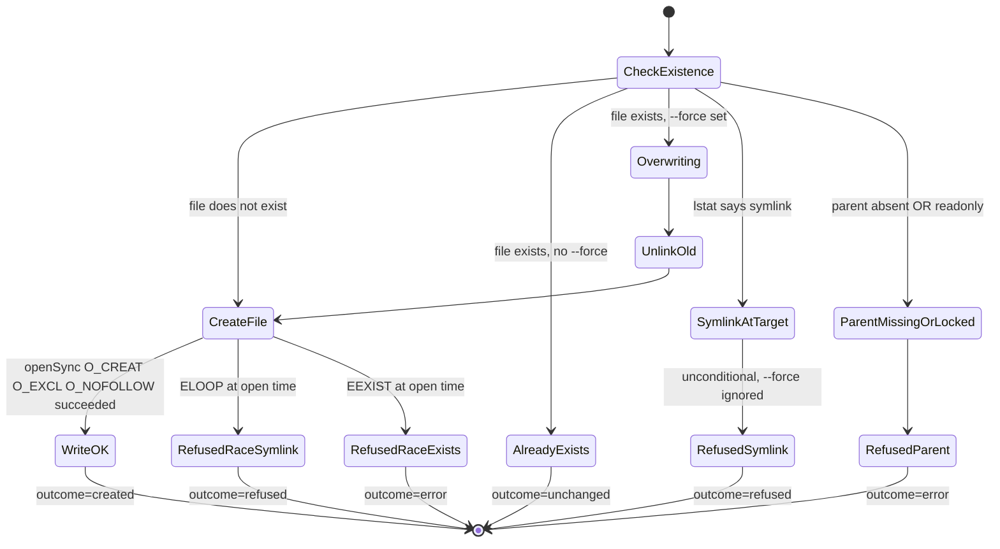
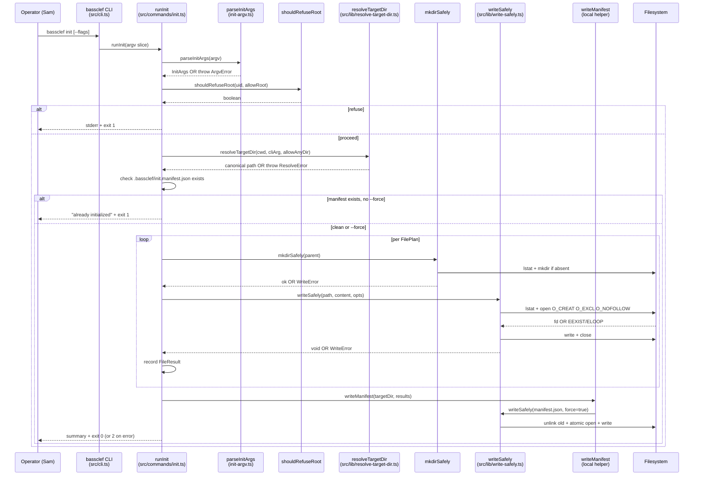

# WU-2 — `bassclef init` command decomposition

WU-1 shipped the shell. WU-2 lands the first command that touches an
adopter's machine. The decomposition below drives the code — luminaries
consult first, pre-mortem names the risks, then the responsibility split
falls out. Contract lives in ADR-002.

## Sources read

- `docs/iteration-bets/2026-08-06b-launch-npm-thebassclef-core.md`
  L122 (WU-2 scope), L136 (discipline touchpoint — /decompose per
  command), L147 (pre-mortem light — 3 lenses × 3 risks)
- `.claude/luminaries/saltzer-schroeder.md` L69-88 (fail-safe defaults),
  L79-88 (complete mediation), L99-107 (separation of privilege),
  L108-120 (least privilege), L121-130 (least common mechanism),
  L131-142 (psychological acceptability)
- `.claude/luminaries/alan-cooper.md` L96-112 (stack translation for
  operator tools), L129-152 (worked example on primary persona)
- `.claude/luminaries/john-ousterhout.md` L58-59 (define errors out of
  existence), L52-53 (deep modules)
- `src/cli.ts` L21-56 (WU-1 dispatcher shape this WU extends)
- `src/commands/init.ts` L1-14 (stub this WU replaces)
- Bassclef substrate example files that WU-2 will emit:
  `~/src/sunj-labs/bassclef/CLAUDE.md` (for orientation import shape),
  `.claude/settings.json` schema (for Claude Code hook wiring)
- ADR-031 (we-don't-break-adopters) — the invariants any adopter-facing
  behavior must honor

## Luminary consult — driving the design

### Saltzer-Schroeder (primary lens for this WU)

The command writes files to adopter machines. Every principle applies:

| Principle | How it shapes WU-2 |
|---|---|
| **1. Economy of mechanism** | Single write function `writeSafely(target, content, options)` ≤ 40 lines. Inspectable in one read. One place for atomic-write + path-check + existence-check. |
| **2. Fail-safe defaults** | DEFAULT: refuse to overwrite existing files. `--force` is the explicit opt-in. Refuse to run as root by default; `--allow-root` required. Refuse to write outside CWD; no path-traversal escape. |
| **3. Complete mediation** | Every file write goes through `writeSafely`. No `fs.writeFileSync` scattered elsewhere. No "trusted internal caller" shortcut. |
| **4. Open design** | `bassclef init --dry-run` lists exactly what will happen. `--help` names every file the command writes. No hidden state. |
| **5. Separation of privilege** | Overwrite requires TWO conditions: file does not exist OR user typed `--force`. Root run requires TWO conditions: `--allow-root` AND `--force` if any target file exists. |
| **6. Least privilege** | Writes only to explicit target dir (default cwd; override via `--dir=<path>`). `--dir` resolved to absolute path; refused if not under `$HOME` unless `--allow-any-dir` is passed. Refuses to follow symlinks at target path (defends against attacker planting a symlink to /etc/passwd). |
| **7. Least common mechanism** | Each write is per-file. If settings.json write fails, substrate.config.md write is skipped, not attempted with a shared failure semantic. Per-write result reported in output. |
| **8. Psychological acceptability** | Errors name WHAT went wrong AND WHAT TO DO. Sam sees "settings.json already exists. Run with --force to overwrite, or delete the file first." NOT "EEXIST: file exists". `--dry-run` matches `--verbose` output format so operator can preview before committing. |

### Alan Cooper (supporting — Sam persona lens)

Sam runs `bassclef init` in one of three shapes:

1. **Empty directory + no prior bassclef.** Happy path. She expects:
   creation confirmation for each file, one-line "what to do next" pointer.
2. **Directory with a Claude Code project already in progress** (settings.json exists, no bassclef yet). She expects: refusal + clear message + choice (`--force`, `--dry-run` to preview, or manual merge). No silent overwrite.
3. **Re-running init in a previously-initialized bassclef repo.** She expects: no-op with "already initialized" confirmation. Not an error. Not "success" that hides that nothing happened.

Sam is not a bassclef expert. Every message she sees must read at grade 8 or lower. Ban words for CLI output: substrate, adopter, workunit, telemetry, dispatcher, andon, provenance, luminary, mediation.

Cooper anti-pattern to avoid: "dancing bear" — celebrating that init works at all. Init should be so unremarkable that Sam forgets she ran it thirty seconds later.

### John Ousterhout (supporting — deep modules + errors out of existence)

- **Deep module:** the command interface is `bassclef init [--force] [--dry-run] [--dir <path>] [--allow-root]`. Small surface. Implementation hides: path resolution, existence check, atomic write, per-file rollback, error message formatting, template loading. Adopters see one command; we own the whole chain.
- **Define errors out of existence:** re-running init is a NO-OP, not an ERROR. Overwriting is CONDITIONAL, not a THROW. `--dry-run` shows the same output as a real run, minus the writes — no separate "dry-run mode error". The API shape refuses to admit error conditions that could be defined away.

## Pre-mortem light — 3 lenses × 3 risks

Per bet L147. Fail vividly; enumerate reasons; name owner + mitigation.

### Saltzer-Schroeder lens risks

1. **RISK: Silent overwrite of adopter's existing Claude Code settings.**
   Sam has a running Claude project. She runs `bassclef init` expecting
   augmentation; instead it clobbers her settings.json.
   - Owner: default behavior in `src/commands/init.ts`
   - Mitigation: DEFAULT DENY on existing files; `--force` required;
     `--dry-run` shows what would happen without doing it. Tier 0 test
     — fixture repo with existing settings.json + `bassclef init` (no
     flags) refuses AND leaves the file untouched.

2. **RISK: Path traversal via `--dir=../../etc`.**
   Malicious operator on a shared machine, or a compromised script,
   runs `bassclef init --dir /etc/systemd`.
   - Owner: `--dir` validation in `src/commands/init.ts`
   - Mitigation: resolve `--dir` to absolute path; if it is not
     under `$HOME`, refuse unless `--allow-any-dir` is passed AND stderr
     prints a clear warning. Tier 0 test — `--dir=/etc/passwd` refuses
     with a specific message.

3. **RISK: Symlink attack — attacker plants symlink `./settings.json → /etc/passwd` in a shared /tmp workspace; init writes to /etc/passwd via the symlink.**
   Compromised CI or shared workspace.
   - Owner: existence check in `writeSafely`
   - Mitigation: use `lstat` not `stat`; if the target path is a symlink,
     refuse (even with `--force`). Tier 0 test — target path pre-populated
     as symlink; init refuses.

### Cooper lens risks

4. **RISK: Sam runs init, sees 12 lines of output including "Applying anticorruption pattern per Vernon", and closes her terminal thinking bassclef is not for her.**
   - Owner: output text in `src/commands/init.ts`
   - Mitigation: output at grade 8 or lower. `/kiss words` dispatch on
     every stderr/stdout string before commit. Tier 0 test —
     scan output for banned words from the substrate jargon list.

5. **RISK: Sam runs init, sees a green "done" message, but nothing actually got written because permissions were wrong; she doesn't notice for an hour.**
   - Owner: exit code + verification in `src/commands/init.ts`
   - Mitigation: after each write, re-read the file and verify size + shebang line. If verification fails, revert (delete the partial file) and report the specific write failure. Tier 0 test — write to read-only directory triggers the specific error message.

6. **RISK: Sam re-runs init and gets a red error like "already initialized" that reads like a failure; she thinks she did something wrong.**
   - Owner: idempotency semantics
   - Mitigation: re-run is a plain-language no-op. Output reads like a
     status report, not an error. Exit code 0 on no-op. Tier 0 test —
     init then init returns 0 with "already initialized (no changes)".

### Ousterhout lens risks

7. **RISK: Half-written state — settings.json succeeds, kilo.json fails, substrate.config.md never attempted. Adopter now has partial init; next run without `--force` refuses to touch settings.json (already there) and successfully writes the other two, leaving Sam with a working repo but confused about why the second run "changed" things.**
   - Owner: transaction semantics
   - Mitigation: write to `.tmp` sibling first, then rename atomically per
     file. Per-file success is per-file; the overall command reports which
     files succeeded and which did not. Rollback is per-file (delete the
     partial `.tmp`).

8. **RISK: Command interface grows one flag at a time (`--force`, `--dry-run`, `--dir`, `--allow-root`, `--allow-any-dir`, `--verbose`) and the CLI's argv parser becomes a linear if-chain that no one can read.**
   - Owner: `src/cli.ts` dispatcher shape
   - Mitigation: extract a small argv parser once N flags ≥ 3. Not a
     library dep (yagni for N=5), a 30-line hand-rolled reducer with a
     test list. Design in decomposition Q1 below.

9. **RISK: The command grows a template loader that reads from disk at runtime, which means the templates must ship in the npm package under `dist/`, which means the build config must copy static assets, which means the invariants ADR-001 pinned (no source shipped, files whitelist) get bent.**
   - Owner: template location + build config
   - Mitigation: templates ship AS TypeScript source under
     `src/commands/init-templates/` and are compiled INTO `dist/cli.js`
     as string literals via Vite's default bundling. No runtime disk
     read for templates. No asset copy step needed. Confirms ADR-001
     invariant that only `dist/` + `README.md` + `LICENSE` ship.

## State diagram — per-file outcome

Each file listed in the plan runs the same state machine. `writeSafely`
(`src/lib/write-safely.ts`) is the single audited mutation point;
every transition below fires there.



Edge cases the diagram covers:

- Symlink at target with `--force` → still `refused` (unconditional per ADR-002)
- TOCTOU race — attacker plants a symlink between the lstat pre-check and the atomic open. `O_NOFOLLOW` at open time closes the gap and produces `RefusedRaceSymlink`.
- Parent directory missing or read-only → `error`, not `refused` (write path failed, not policy)
- `--force` alone still refuses a symlink; only unlinks a regular file

## Sequence diagram — bassclef init dispatch



Traceability:

- Every actor above appears in `src/commands/init.ts` and its imports.
- ADR-002 §Complete-mediation names `writeSafely` + `mkdirSafely` as the ONLY filesystem writers in this chain — the diagram makes that concrete.

## Boundary objects — what adopters see

| Boundary | Shape |
|---|---|
| `bassclef init` command line | Verb + optional flags. Success = zero stdout to shell noise, quiet report on stderr. Failure = specific error on stderr + non-zero exit. |
| Written files | Three at most (per bet L122): `.claude/settings.json`, `.claude/kilo.json`, `substrate.config.md`. Every path is under the target directory. Every file is human-readable. |
| `--help` text | Lists every flag + every file that will be written + the safety defaults + the escape hatches. |
| `--dry-run` output | Same shape as a real run, minus the writes. Shows exactly what would happen. Cooper trust-signal for Sam. |

## Entity objects — domain state

| Entity | Where it lives | Read-only or written by WU-2? |
|---|---|---|
| Target directory | resolved from cwd or `--dir` | Read (cwd resolution + existence check) |
| Target files (settings.json, kilo.json, substrate.config.md) | inside target directory | Written (per fail-safe rules) |
| Template strings | compiled into `dist/cli.js` as source constants | Read (imported at command time) |
| Package version | package.json + `src/index.ts` (already shipped WU-1) | Read (stamped into written files where relevant) |

## Control objects — the code that runs

| Control | Responsibility | Shape |
|---|---|---|
| `runInit(args)` in `src/commands/init.ts` | Parse args, resolve target dir, iterate writes, report result | ≤ 100 lines. Delegates all IO to `writeSafely`. |
| `writeSafely(path, content, opts)` | THE ONE PLACE any file write happens. Existence check, symlink refusal, temp-file-then-rename, size verification. | ≤ 40 lines. Single-responsibility. |
| `resolveTargetDir(cliArg)` | Turn `--dir` value (or default cwd) into an absolute path. Refuse traversal. Refuse outside HOME without opt-in. | ≤ 30 lines. Pure — returns a resolved path or throws a typed error. |
| `renderTemplates(targetDir, pkgVersion)` | Return an array of `{path, content}` records. Zero IO. | ≤ 20 lines. Pure function. |
| Template constants under `src/commands/init-templates/` | Source strings for each of the three files. Compiled into `dist/cli.js`. | ≤ 60 lines total across all three templates. |

## Interface shape

```
bassclef init [options]

Options:
  --dir <path>       Target directory. Default: current working directory.
  --force            Overwrite existing files. Default: refuse.
  --dry-run          Print what would be written; write nothing.
  --allow-root       Allow running as root. Default: refuse.
  --allow-any-dir    Allow --dir outside $HOME. Default: refuse.
  --verbose          Print per-file result.

Files that will be written under <target>:
  .claude/settings.json      — Claude Code settings + SessionStart hook wiring
  .claude/kilo.json          — Kilo config placeholder
  substrate.config.md        — Bassclef project manifest

Exit codes:
  0  Success (all writes succeeded, or all files already present as no-op)
  1  Refused — file exists and --force not passed; or root without --allow-root
  2  Write failed after safety checks — see stderr for path + error
  3  Invalid args — see stderr for usage
```

## Test list first (Beck)

The full list drives implementation. Tests written before source per
`.claude/rules/test-list-discipline.md`.

Tier 0 — MUST pass before merge:

- [ ] fresh empty target dir → all three files written; exit 0; verbose stdout lists each file
- [ ] rerun on already-initialized dir → all three files unchanged; exit 0; "already initialized" message
- [ ] target dir has existing settings.json → refuses; exit 1; message names `--force` as remediation
- [ ] target dir has existing settings.json + `--force` → overwrites settings.json; exit 0
- [ ] `--dry-run` on empty target → prints the same shape as real run; writes nothing
- [ ] `--dry-run` on partially-initialized target → prints "would refuse" + "would create" per file
- [ ] `--dir /tmp/xyz` where `/tmp/xyz` doesn't exist → refuses with "directory does not exist" message
- [ ] `--dir=/etc/systemd` (outside HOME) → refuses; exit 1; message names `--allow-any-dir`
- [ ] running as root (uid 0 fixture) → refuses; exit 1; message names `--allow-root`
- [ ] target path is a symlink (attacker case) → refuses even with `--force`; exit 2
- [ ] no output line contains banned words from the jargon block list

Tier 1 — SHOULD pass:

- [ ] `--verbose` output is stable across runs (deterministic ordering)
- [ ] failed write on file 2 of 3 → leaves files 1 written, file 2 partial cleaned up, file 3 unattempted; exit 2 with specific error

Deferred to later WU:

- [ ] Interactive prompt shape (`bassclef init` in TTY) — WU-3 or later
- [ ] Merge instead of overwrite for settings.json — WU-3 (needs schema-aware merger)

## Open questions

Q1 — CLI dispatcher shape. WU-1 shipped a linear if-chain in
`src/cli.ts`. WU-2 adds `--force`, `--dry-run`, `--dir`, `--allow-root`,
`--allow-any-dir`, `--verbose` — six flags. Do we extract a small
argv reducer now, or extend the if-chain? Recommendation: extract at
N=3, we are at N=6 for init alone. Small 30-line reducer with its own
test list. No library dep.

Q2 — Where do templates live? Confirmed above: `src/commands/init-templates/`
as TypeScript string constants. Compiled into `dist/cli.js`. Zero
runtime disk read. Honors ADR-001 invariants.

Q3 — What about `.claude/kilo.json` shape? Bet L122 names it but I have
not read a kilo.json schema during this session. Recommendation: emit
a minimal `{}` placeholder for WU-2; note the schema-authoring task
for a follow-on WU. Alternative: skip kilo.json entirely, land in a
separate PR after Kilo's schema is known. Decision deferred to
challenger subagent.

Q4 — Should the write function also verify the parent directory is
writable BEFORE opening the temp file? Ousterhout's "define errors out
of existence" says yes — no point starting the write if we know it
will fail. Recommendation: check `os.access(parent, W_OK)` first;
early return with a specific message.

## What WU-2 must produce

- [ ] `src/commands/init.ts` rewritten from stub to real command
- [ ] `src/commands/init-templates/` — three template strings (settings.json, kilo.json, substrate.config.md)
- [ ] `src/lib/write-safely.ts` — the single audited write function
- [ ] `src/lib/resolve-target-dir.ts` — the path resolver
- [ ] `src/lib/argv.ts` — small argv reducer (Q1)
- [ ] `src/cli.ts` updated to route init flags through the reducer
- [ ] `tests/init.test.ts` — Tier 0 tests
- [ ] `tests/write-safely.test.ts` — write function tests
- [ ] `tests/resolve-target-dir.test.ts` — path resolver tests
- [ ] `docs/adrs/ADR-002-bassclef-init-safety-contract.md` — records the safety contract
- [ ] `CHANGELOG.md` `[Unreleased]` block updated

## What WU-2 does NOT ship

- Real `bassclef sync` — the sync workunit
- Publish pipeline — the publish workunit
- Interactive prompt / TTY-aware UX — later work
- Schema-aware settings.json merger — later work
- Rollback across all three writes (transactional init) — later
  work; per-file atomicity is enough for WU-2
- Git working-tree cleanliness check — out of scope. Init may land
  files in a dirty working tree. User owns her commit boundary.
- `bassclef init` in an already-cloned kilo project — Kilo schema
  is not known this session; kilo.json is skipped from WU-2 output.
  Adds later when the schema is decided.

## Challenger pass — 2026-08-06

Second-agent read of the decomposition before code. Five PATCH-level
fixes fold in below. Three NOTEs captured for review.

### P1 — Symlink defense uses atomic open, not lstat + rename

Original design (line 105, 173) said: lstat then rename. Between the
lstat and the rename, an attacker on a shared filesystem could swap
the target. This is a TOCTOU race and defeats the check.

Revised design: every write uses `fs.openSync(path, O_CREAT | O_EXCL
| O_NOFOLLOW | O_WRONLY, 0o644)`. `O_EXCL` refuses if the file
already exists (atomic existence check). `O_NOFOLLOW` refuses to
follow a symlink at the final path component. If the file exists and
`--force` is set, we first `fs.unlinkSync(path)` (which itself
refuses to follow the final symlink component) then retry the open.
No temp-file-then-rename dance; the atomic open is the safety.

### P2 — Target directory ownership check

Original design refused `--dir` outside `$HOME` unless `--allow-any-dir`.
That check is not enough on shared machines: `/tmp/attacker-prep-dir`
may symlink into `$HOME` or live under a world-writable path.

Revised design:

1. Resolve `--dir` (or cwd) via `fs.realpathSync` to canonicalize
   symlinks and traversals.
2. If the resolved path is not under `$HOME`, refuse unless
   `--allow-any-dir` is passed.
3. `fs.statSync` the target dir. If `stat.uid !== process.getuid()`,
   refuse unless `--allow-any-dir` is passed.

Two independent checks. Both must pass, or the operator opts out via
one flag.

### P3 — Escape-hatch matrix

Original design listed the flags separately without naming their
combinations. Added the matrix below.

| Flag | Disables |
|---|---|
| `--force` | The existence check for each file. Overwrite is now attempted. Every other safety check still runs. |
| `--allow-root` | The root refusal. Command runs as uid 0. No other check disabled. |
| `--allow-any-dir` | Both the `$HOME`-scoping check AND the target-directory ownership check. No other check disabled. |

Flags are orthogonal. `--allow-root --allow-any-dir --force` combined
disables the three explicitly named checks; every other safety
(symlink refusal via O_NOFOLLOW, parent-directory writability, write
verification) still fires.

### P4 — Dry-run always prints the plan

Original design said dry-run "matches the real run minus writes." Real
run is quiet on success, so dry-run of quiet is empty. That defeats
the trust signal.

Revised: dry-run ALWAYS prints one line per target file, in this
shape:

```
would create   /path/to/.claude/settings.json
would skip     /path/to/substrate.config.md  (already exists — use --force)
would refuse   /path/to/.claude/settings.json (symlink at target)
```

Real run in `--verbose` mode prints the same lines with `created`,
`skipped`, `refused`. Real run without `--verbose` prints a one-line
summary: `2 created, 1 unchanged`. Dry-run does not honor
`--verbose` — it prints the per-file plan every time.

### P5 — Partial-state Tier 0 test added

Added to test list:

- [ ] target has `settings.json` only, other two files missing → init
  writes the other two AND reports `2 created, 1 unchanged`; exit 0

The summary line format lands as a stable text — a scripted caller
can parse `<N> created, <M> unchanged`. Refused files report on their
own line above the summary.

### N1 — Kilo.json dropped from WU-2

Original design proposed emitting `{}`. Kilo schema is not known
this session, and emitting `{}` defers the error rather than
defining it away (Ousterhout). Decision: WU-2 does not emit
`.claude/kilo.json`. The file is added in a later WU when the Kilo
schema is decided. Bet L122 is amended by this note; the acceptance
criterion updates accordingly.

### N2 — Exit code categories clarified

- `0` — success (all writes succeeded OR all files already correct)
- `1` — refused by policy (file exists + no `--force`; root + no
  `--allow-root`; target outside `$HOME` + no `--allow-any-dir`;
  target dir not owned by current user + no `--allow-any-dir`;
  invalid args)
- `2` — safety check failed at write time (symlink at target path;
  parent not writable; verification after write failed)

Symlink refusal is `2`, not `1`, because the check runs at write time
via `O_NOFOLLOW`, not at pre-flight.

### N3 — Git worktree cleanliness

Not addressed by this WU. Captured in "does NOT ship" above. User
owns her commit boundary.

### Final file list — revised

- [ ] `src/commands/init.ts` — command entry
- [ ] `src/commands/init-templates/settings.json.ts` — Claude Code
      settings template
- [ ] `src/commands/init-templates/substrate-config.md.ts` — bassclef
      project manifest template
- [ ] `src/lib/write-safely.ts` — the atomic write function
- [ ] `src/lib/resolve-target-dir.ts` — path resolver with ownership
      check
- [ ] `src/lib/argv.ts` — small argv reducer
- [ ] `src/cli.ts` — updated dispatcher (routes `init` + flags)
- [ ] `tests/init.test.ts` — Tier 0 test suite (11 tests including
      partial-state)
- [ ] `tests/write-safely.test.ts` — write function tests
- [ ] `tests/resolve-target-dir.test.ts` — path resolver tests
- [ ] `tests/argv.test.ts` — argv reducer tests
- [ ] `docs/adrs/ADR-002-bassclef-init-safety-contract.md`
- [ ] `CHANGELOG.md` `[Unreleased]` block updated

Kilo.json template dropped from the list per N1.
