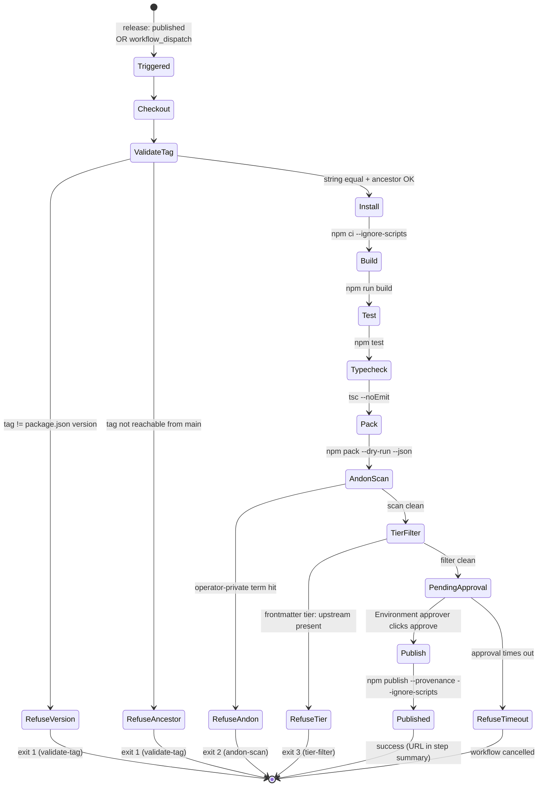

# WU-4 — publish pipeline decomposition

WU-1 shipped the package shape. WU-2 landed init. WU-3 landed sync.
WU-4 lands the mechanism that ships every subsequent version to npm
safely.

## Sources read

- `docs/iteration-bets/2026-08-06b-launch-npm-thebassclef-core.md`
  L124 (WU-4 scope), L92-108 (npm best practices)
- `docs/adrs/ADR-001-npm-package-build-toolchain.md` — no
  `prepublishOnly`, no source shipped, engines pinned
- `docs/adrs/ADR-002-bassclef-init-safety-contract.md` — safety
  posture inheritance
- `docs/adrs/ADR-003-bassclef-sync-safety-contract.md` — safety
  posture inheritance
- `~/src/sunj-labs/bassclef/scripts/release-to-bassclef.sh` — prior
  art for the andon scan + tier filter shape
- `~/src/sunj-labs/bassclef/standards/bassclef-internal-jargon.md`
  — one BLOCK-tier list that operator-facing prose must not carry
- npm docs referenced by the bet L100-108:
  - Trusted publishing (docs.npmjs.com/trusted-publishers/)
  - `--provenance` attestation
  - `--ignore-scripts` at publish
  - Evil Martians 2026 secure-release guide (no `prepublishOnly`)

## Luminary consult — driving the design

### Saltzer-Schroeder (primary)

Publish is the only path that writes to the npm registry. Every
principle applies with more weight than before.

| Principle | How it shapes WU-4 |
|---|---|
| **1. Economy of mechanism** | Workflow file ≤ 150 lines. Scan scripts ≤ 100 lines each. Every step readable in one pass. |
| **2. Fail-safe defaults** | Publish REFUSES on any check failure. No opt-in "publish anyway." Overrides live only at the repo-settings level (Environment approval), not in the workflow YAML. |
| **3. Complete mediation** | Every publish flows through the workflow. `npm publish` from a developer's laptop is impossible — trusted publisher only accepts calls from the configured GitHub Actions workflow. |
| **4. Open design** | Workflow is public. Every check names its rule. Trusted-publisher config is documented per bassclef-cli's docs/publish-setup.md. |
| **5. Separation of privilege** | Publish requires FOUR independent conditions: tag pushed by operator, GitHub Environment approval, workflow file unchanged from `main`, package.json version matches tag. Any failure refuses. |
| **6. Least privilege** | Workflow runs with the minimum GitHub Actions permissions: `id-token: write` for trusted publishing, `contents: read` for checkout. No `contents: write`, no `packages: write`. |
| **7. Least common mechanism** | Andon scan + tier filter + tag validator are separate scripts. Each has its own responsibility. No shared "publish helper" that grows over time. |
| **8. Psychological acceptability** | Operator's release flow is: `git tag vX.Y.Z && git push origin vX.Y.Z && gh release create vX.Y.Z`. The workflow handles the rest. Refusal messages name the failing check. |

### Alan Cooper (supporting — operator experience)

The operator is a persona of one — the maintainer publishing a
release. Her mental model:

1. "I finished a feature. I want it on npm."
2. "I bump the version. I tag the release. GitHub does the rest."
3. If it fails: "Tell me what to fix."

Cooper anti-pattern to avoid: a workflow that succeeds but publishes
the wrong thing. Refuse loudly over "helpful."

### John Ousterhout (supporting)

- **Deep module:** the workflow is one file with one job. Its
  interface is "a release tag" → "a published version on npm." The
  implementation hides validation, scan, build, test, publish.
- **Define errors out of existence:** the tag validator refuses tags
  that do not start with `v`. The version validator refuses
  package.json versions that do not match the tag. The pipeline
  cannot publish a mis-tagged release; the error class is defined
  away.

### Vaughn Vernon (supporting — for bassclef #1143 contract)

The bet L124 names Vernon's anticorruption pattern. The publish
pipeline in a future WU will read `lite-manifest.json` from bassclef
to decide which substrate files can ship. Reading the MANIFEST rather
than raw bassclef frontmatter decouples the CLI package from
bassclef's internal file naming.

**Scope check:** WU-4 does not ship substrate assets. The tier filter
lands as machinery only. The lite-manifest read lands when substrate
bundling starts. Documented in "does NOT ship" below.

## Pre-mortem light — 3 lenses × 3 risks

### Saltzer-Schroeder lens risks

1. **RISK: A maintainer's stolen laptop publishes a malicious version.**
   Attacker on the maintainer's machine can `npm publish` directly.
   - Owner: publish authentication
   - Mitigation: TRUSTED PUBLISHER config on npm. `npm publish` from
     a laptop fails; only GitHub Actions can publish. The stolen
     laptop cannot push a malicious version without also compromising
     the operator's GitHub account AND the Environment approver.

2. **RISK: A wrong tag ships to production.** Operator tags `v0.1.0`
   but package.json still says `0.0.9`.
   - Owner: version validator
   - Mitigation: `scripts/validate-tag.mjs` refuses if `package.json`
     version does not exactly match the tag ref (stripped of `v`
     prefix). Refusal message names the fix.

3. **RISK: Operator-private content leaks in a shipped file** —
   filesystem paths, personal email addresses, private-directory
   references.
   - Owner: andon scan
   - Mitigation: `scripts/andon-scan.mjs` scans every file in the
     tarball (`npm pack --json --dry-run`) against a term list.
     Refuses on any match unless the file carries an
     `# andon-allow: <regex>` header (per-file allowlist). List
     starts narrow; grows on incident.

### Cooper lens risks

4. **RISK: Operator runs the release workflow, sees a green check,
   thinks it published — but `dist/` was stale.**
   - Owner: build discipline
   - Mitigation: the workflow rebuilds from source every run
     (`npm run build`), not from a cached artifact. `dist/` in the
     repo is ignored by CI. Cache misses are honest.

5. **RISK: Operator wants to publish a release candidate; refuses
   because the version is `1.0.0-rc.1`.**
   - Owner: tag validator regex
   - Mitigation: validator accepts semver pre-release syntax
     (`v1.0.0-rc.1`, `v0.5.0-beta.3`). Only rejects tags that do not
     match the semver pattern at all.

6. **RISK: Operator does not know how to set up trusted publishing on
   npmjs.com — the workflow fails with a cryptic auth error.**
   - Owner: onboarding docs
   - Mitigation: `docs/publish-setup.md` covers the out-of-band
     setup steps with screenshots-worth-of-detail: enable trusted
     publisher on npmjs.com, create the GitHub Environment named
     `npm-publish` with the operator as required reviewer, tag the
     first release.

### Ousterhout lens risks

7. **RISK: The workflow accumulates one-off flags per release.**
   Version 1: `--tag latest`. Version 2 adds `--tag beta`. Version 3
   adds environment gating per tag. Grows into a matrix no one can
   read.
   - Owner: workflow authorship
   - Mitigation: refuse to add per-release logic to the workflow.
     Every release runs the same steps. Special releases (RCs, betas)
     use the same `--tag <label>` mechanism controlled by tag suffix
     detection — pattern in the ADR, not accumulated in YAML.

8. **RISK: The andon scan and tier filter share code that grows into
   a bespoke framework.** "release-checks.mjs" becomes 500 lines with
   plugin registration.
   - Owner: script authorship
   - Mitigation: keep each script single-purpose. `andon-scan.mjs`
     scans terms. `tier-filter.mjs` scans tier frontmatter. No shared
     library. Both under 100 lines.

9. **RISK: The scan scripts get so strict that legitimate content
   trips them.** Every release requires operator overrides.
   - Owner: term list authorship
   - Mitigation: start NARROW. Only terms with clear operator-private
     signature. Per-file `# andon-allow:` header for legitimate
     cases (matches bassclef's pattern). Track override frequency —
     if more than one release in ten needs an override, tighten the
     list, do not widen the escape hatch.

## State diagram — publish workflow

The workflow is one linear state machine. Any REFUSE state ends the
run; there is no partial publish.



Edge cases the diagram covers:

- Pre-release tags (`v0.5.0-rc.1`) — the same states fire; `Publish`
  dispatches with `--tag next` instead of `--tag latest`. The state
  machine does not branch; the tag suffix drives one flag inside the
  `Publish` step.
- Approver rejects at `PendingApproval` — same as timeout: workflow
  cancelled, nothing published.
- Any refusal leaves npm untouched. There is no rollback state
  because there is no forward-then-back sequence.

## Sequence diagram — publish flow

```mermaid
sequenceDiagram
    participant Op as Operator
    participant Git as GitHub
    participant Actions as GitHub Actions<br/>(publish.yml)
    participant Tag as validate-tag.mjs
    participant NPM as npm CLI
    participant Andon as andon-scan.mjs
    participant Tier as tier-filter.mjs
    participant Env as Environment approver
    participant Registry as npm registry

    Op->>Git: git tag vX.Y.Z<br/>git push origin vX.Y.Z
    Op->>Git: gh release create vX.Y.Z
    Git->>Actions: release event (published)
    Actions->>Git: checkout at tag ref
    Actions->>Tag: node scripts/validate-tag.mjs $TAG
    Tag->>Tag: string-equal(tag, package.json.version)
    Tag->>Git: git merge-base --is-ancestor $TAG origin/main
    Tag-->>Actions: OK OR refuse
    Actions->>NPM: npm ci --ignore-scripts
    NPM-->>Actions: node_modules installed
    Actions->>NPM: npm run build
    NPM-->>Actions: dist/ produced
    Actions->>NPM: npm test
    Actions->>NPM: npm run typecheck
    Actions->>NPM: npm pack --dry-run --json
    NPM-->>Actions: tarball file list
    Actions->>Andon: node scripts/andon-scan.mjs
    Andon-->>Actions: OK OR refuse
    Actions->>Tier: node scripts/tier-filter.mjs
    Tier->>Tier: parse YAML frontmatter on each shipped file
    Tier-->>Actions: OK OR refuse
    Actions->>Env: request Environment approval
    Env-->>Actions: approved
    Actions->>NPM: npm publish --provenance --ignore-scripts
    NPM->>Registry: publish + attestation<br/>(trusted publisher; no token)
    Registry-->>NPM: 200 OK
    NPM-->>Actions: version live
    Actions->>Op: step summary with URL
```

Traceability:

- Every actor traces to a concrete file that WU-4 lands
  (`.github/workflows/publish.yml`, `scripts/validate-tag.mjs`,
  `scripts/andon-scan.mjs`, `scripts/tier-filter.mjs`).
- Environment approver ↔ operator identity via
  `docs/publish-setup.md` (Environment named `npm-publish`, operator
  as required reviewer per ADR-004 K3 accepted-risk decision).
- No `NPM_TOKEN` or `NODE_AUTH_TOKEN` appears in any actor — trusted
  publisher authentication is the whole story.

## Boundary objects — what the operator sees

| Boundary | Shape |
|---|---|
| `git tag vX.Y.Z && git push origin vX.Y.Z` | The operator's trigger. Standard git. |
| GitHub Release page | The workflow reads the release event. Manual dispatch also supported via `workflow_dispatch`. |
| GitHub Environment `npm-publish` | Required approval before publish step. Operator clicks "approve" from the workflow run page. |
| `docs/publish-setup.md` | Playbook the operator reads once. Trusted publisher setup + Environment + first release. |
| Failure message on a check | Names the check + the fix. |

## Entity objects — the artifacts

| Entity | Where it lives | Read or written by WU-4? |
|---|---|---|
| `package.json` `version` | root | Read by tag validator |
| Git tag (e.g. `v0.0.2`) | git | Read by workflow via `${{ github.ref }}` |
| `dist/**` | rebuilt every run | Read by scan scripts before publish |
| Andon term list | `scripts/andon-scan.mjs` inline | Read at scan time |
| Tier frontmatter (any `tier: upstream` shipped) | inside scanned files | Read by tier filter |
| Trusted publisher config | npmjs.com out of band | Consumed by the publish step |
| Provenance attestation | generated by npm CLI on publish | Written to npm |

## Control objects

| Control | Responsibility | Shape |
|---|---|---|
| `.github/workflows/publish.yml` | Orchestrates the pipeline | One workflow, one job, ordered steps. ≤ 150 lines. |
| `scripts/validate-tag.mjs` | Refuses if tag != version | Pure Node, ≤ 60 lines, no deps |
| `scripts/andon-scan.mjs` | Refuses on operator-private terms | Pure Node, ≤ 100 lines, no deps |
| `scripts/tier-filter.mjs` | Refuses on `tier: upstream` frontmatter | Pure Node, ≤ 80 lines, no deps |

## Interface shape

Workflow triggers:

- `release: types: [published]` — a GitHub Release publish event
- `workflow_dispatch:` — manual with input `tag`

Steps in order (refuse on any failure):

1. Checkout at the tag ref.
2. Setup Node 20.
3. `npm ci --ignore-scripts` — install with no script execution.
4. `node scripts/validate-tag.mjs` — tag ↔ package.json version match.
5. `npm run build` — clean rebuild.
6. `npm test` — full test suite.
7. `npm run typecheck` — TypeScript strict.
8. `npm pack --json` (dry-run) — get the tarball file list without shipping.
9. `node scripts/andon-scan.mjs <tarball-manifest>` — refuse on term match.
10. `node scripts/tier-filter.mjs <tarball-manifest>` — refuse on `tier: upstream`.
11. **Environment gate** — GitHub Environment `npm-publish` requires operator approval.
12. `npm publish --provenance --ignore-scripts` via trusted publisher.

Exit shape:

- All steps pass → published on npm with provenance attestation
- Any step fails → workflow red, nothing published
- Environment gate not approved → workflow paused, nothing published

## Test list first (Beck)

Tier 0 for scan scripts (run locally + in CI):

- [ ] `validate-tag.mjs` accepts `v0.0.2` when `package.json` is `0.0.2`
- [ ] `validate-tag.mjs` rejects `v0.0.2` when `package.json` is `0.0.3`
- [ ] `validate-tag.mjs` accepts `v1.0.0-rc.1` semver pre-release
- [ ] `validate-tag.mjs` rejects tag without `v` prefix
- [ ] `validate-tag.mjs` rejects non-semver tag
- [ ] `andon-scan.mjs` catches an operator-private path reference
- [ ] `andon-scan.mjs` catches an absolute POSIX home path (e.g. `/Users/*`)
- [ ] `andon-scan.mjs` passes a clean tarball
- [ ] `andon-scan.mjs` respects `# andon-allow: <pattern>` per-file exemption
- [ ] `tier-filter.mjs` catches a file with `tier: upstream` in frontmatter
- [ ] `tier-filter.mjs` accepts `tier: standard`, `tier: lite`, and no-frontmatter files

Workflow validation (in CI only — cannot run locally):

- The `.github/workflows/publish.yml` YAML parses
- The workflow's permission set is exactly `id-token: write` + `contents: read`
- No `NPM_TOKEN` or `NODE_AUTH_TOKEN` reference (trusted publisher only)

## Open questions

Q1 — Do scan scripts run over `dist/` or over the packed tarball?
Answer: the packed tarball via `npm pack --dry-run --json`. That
gives us the exact file list npm will ship, respecting the `files`
whitelist. Scanning `dist/` alone misses `README.md` and `LICENSE`.

Q2 — Where does the andon term list live? Inline in
`andon-scan.mjs` for now. If more terms accumulate, split into
`scripts/andon-terms.txt` and let the scanner read it. Not
prematurely.

Q3 — Does the pipeline read bassclef's `lite-manifest.json`? Not in
WU-4. Deferred until the CLI package bundles substrate content that
needs tier filtering. Documented in "does NOT ship."

Q4 — Semver pre-release tags (`v0.5.0-rc.1`) get published to a
different npm dist-tag (`--tag next` instead of `latest`)?
Recommendation: parse the tag; if it has a pre-release suffix, use
`--tag next`; else `--tag latest`. Land the parser as part of
`validate-tag.mjs`.

## What WU-4 must produce

- [ ] `.github/workflows/publish.yml` — the pipeline
- [ ] `scripts/validate-tag.mjs` — tag/version match + semver + dist-tag decision
- [ ] `scripts/andon-scan.mjs` — operator-private term scanner
- [ ] `scripts/tier-filter.mjs` — `tier: upstream` frontmatter refuser
- [ ] `tests/validate-tag.test.ts` — Tier 0
- [ ] `tests/andon-scan.test.ts` — Tier 0
- [ ] `tests/tier-filter.test.ts` — Tier 0
- [ ] `docs/publish-setup.md` — operator playbook
- [ ] `docs/adrs/ADR-004-publish-pipeline-safety-contract.md`
- [ ] `CHANGELOG.md` `[Unreleased]` block updated

## What WU-4 does NOT ship

- Bundled substrate assets — later work. The tier filter is
  machinery that runs; today it finds nothing.
- Reading `lite-manifest.json` per bassclef #1143 — deferred to the
  substrate-bundling WU. When it lands, the filter script gains a
  manifest-driven path.
- Automated version bump. Operator bumps `package.json` by hand +
  commits + tags. `npm version` is fine; not enforced.
- Pre-release channel management (npm dist-tags beyond `latest` and
  `next`). Later work if release candidates need more granularity.
- Rollback via `npm unpublish`. Deprecated by npm for versions older
  than 72 hours. The pipeline's job is REFUSING to publish something
  wrong; live rollback is a separate incident procedure.
- Release-notes drafting. `gh release create` writes the release; the
  workflow publishes. Release notes come from the operator (or a
  future release-notes WU).

## Challenger pass — 2026-08-06

Second-agent read of the decomposition before code. Three KILL-level
fixes fold in below. PATCHes below cover smaller shape corrections.

### K1 — Workflow filename is a semver-locked invariant

Original decomp implied the workflow path was mutable. It is not.
npm's trusted-publisher config pins the exact repo + workflow file
path. Renaming `.github/workflows/publish.yml` in a future PR breaks
publishing silently — the workflow runs, but npm refuses the
authentication and every release fails until an operator logs into
npmjs.com and updates the config.

Revised: ADR-004 lists `.github/workflows/publish.yml` as a
semver-locked invariant. Any rename requires:

1. An ADR amendment (or superseding ADR).
2. An npm-side config change on `npmjs.com/settings/... /packages/@thebassclef/core`.
3. Both must ship in the same coordinated release.

A Tier 0 test asserts the exact path exists.

### K2 — Tier filter parses YAML frontmatter, not substrings

Original design ran a substring search for `tier: upstream` across
every shipped file. A README that documents the tier system with
`| tier: upstream | internal only |` in a table would trip.

Revised: the tier filter only inspects files where the FIRST bytes
form a YAML frontmatter block (`^---\n` at BOF). It parses that
block for a `tier:` key and refuses on `upstream`. Files without
frontmatter are ignored. Substring matches inside file bodies are
ignored.

The parser is a small manual implementation — not `js-yaml` or any
runtime dep. Regex on the frontmatter block only:

```
^---\n(.*?)\n---\n
```

then `^tier:\s*(\S+)$` on the extracted block.

Test cases cover:
- Frontmatter with `tier: upstream` → refuse
- Frontmatter with `tier: lite` → pass
- Frontmatter with no `tier` key → pass
- No frontmatter at all → pass
- `tier: upstream` in a Markdown table BELOW the frontmatter → pass

### K3 — Single-reviewer Environment approval — accepted risk

Original design named "operator as required reviewer." Saltzer-
Schroeder principle 5 (separation of privilege) argues for N-of-M
approvers on the highest-risk gate. This project has ONE operator.
Two-of-two would mean the operator approves twice from two accounts —
theater, not defense.

Accepted risk: single-reviewer Environment gate. The single point of
compromise is the operator's GitHub account. Mitigations layered
elsewhere:

- The operator's GitHub account uses passkey / YubiKey 2FA (documented
  in `docs/publish-setup.md`).
- Trusted publisher config on npm is a separate account requiring
  its own 2FA to change.
- Every publish shows in the workflow run history and the
  `security-events` log; a compromise is visible after the fact.
- N-of-M can be added by adding reviewers to the Environment when a
  second maintainer joins. No code change; a repo-settings edit.

ADR-004 names this as an accepted-risk decision with the mitigation
chain and the trigger for revisit (second maintainer).

### P1 — `--ignore-scripts` on BOTH install and publish

- Step 3 (`npm ci --ignore-scripts`) blocks install-time scripts on
  every dep, including transitives. Prevents supply-chain script
  execution during CI.
- Step 12 (`npm publish --ignore-scripts`) blocks pre/post-publish
  scripts in this package. Belt AND suspenders — ADR-001 already
  refuses to define a `prepublishOnly` script.

Documented as a paired invariant in ADR-004.

### P2 — Version validator uses string equality

Semver-equal (`v0.0.2-beta.1` == `0.0.2-beta.01`) would silently
accept typos. String equality is stricter and safer. Choose it
explicitly.

Test cases:
- `v0.0.2` + package.json `0.0.2` → accept
- `v0.0.2` + package.json `0.0.3` → refuse
- `v0.0.2-beta.1` + package.json `0.0.2-beta.1` → accept
- `v0.0.2-beta.1` + package.json `0.0.2-beta.01` → refuse (string not equal)
- `0.0.2` without `v` prefix → refuse
- `v0.0.2.4` (four-segment) → refuse (not semver)

### P3 — Release event + tag-on-non-main gap

Revised:

- Workflow triggers on `release: types: [published]`. GitHub fires
  this event for both stable releases and pre-releases (the
  `prerelease` field on the release event is a flag, not a separate
  type). The workflow honors the flag: pre-release publishes to
  `--tag next`, stable publishes to `--tag latest`.
- The tag validator additionally asserts that the tagged commit is
  reachable from `origin/main`. If not, refuse with a message naming
  `git merge-base --is-ancestor <tag> origin/main` as the check that
  failed.

Test case: a tag on a feature branch that was never merged to main
refuses at validate-tag time.

### P4 — Refusal message shape spelled out

Every refusal names three things: what failed, what value it found,
what the operator should do next.

Validate-tag example:

```
validate-tag: version mismatch.
  package.json (./package.json) has version 0.0.9.
  tag v0.1.0 expects 0.1.0.
  fix: bump package.json to 0.1.0, commit, delete + re-push the tag.
```

Andon example:

```
andon-scan: operator-private term found.
  file: dist/cli.js
  term: /Users/sanjay2025
  fix: rebuild from a CI-clean checkout, or add an `# andon-allow:` line if the reference is intentional.
```

Tier-filter example:

```
tier-filter: file marked tier: upstream.
  file: dist/substrate/example.md
  tier: upstream
  fix: retag the source file with tier: lite or tier: standard, or exclude it from the files array.
```

### P5 — Andon term list re-narrowing cadence

ADR-004 pins a quarterly review. Any term un-tripped in six months
comes out of the list. The list stays narrow; drift gets pruned.

The review happens as an issue on the repo tagged
`review: andon-list`. Ownership: the operator.

### P6 — Scope check against bet acceptance

Bet L124 says WU-4 "reads lite-manifest.json per #1143 contract."
Decomp defers this. Cross-check against bet acceptance at L155-157:

- L153 — repo bootstrapped (WU-1 done)
- L154 — `bassclef init` (WU-2 done)
- L155 — `bassclef sync` (WU-3 done)
- L156 — publish pipeline strips `tier: upstream` files (WU-4 does
  this via tier-filter script)
- L157 — publish pipeline runs andon scan for operator-private terms
  (WU-4 does this via andon-scan script)
- L158 — publish uses trusted publisher config; provenance
  attestations (WU-4 does this via workflow + npm CLI flags)

None of the acceptance items require reading `lite-manifest.json`.
The bet's L124 language is aspirational for a later WU that bundles
substrate; the acceptance items are what actually locks. Deferral is
honest.

Documented in Q3 of open questions.

### P7 — Four scripts vs one — decision recorded

Chose four separate scripts over one `release-checks.mjs` with
subcommands.

Rationale:

- Each script has one job and can be understood in isolation
  (Ousterhout economy of mechanism + Saltzer least common mechanism).
- Failure of one script does not couple to others through shared
  state.
- CI logs show which specific check failed by script name in the
  workflow step title — no need to parse subcommand output.
- Splitting later (if a shared library actually emerges) is easier
  than un-splitting a bespoke framework.

Cost: mild boilerplate duplication (each script has an argv parser,
a stderr-write-on-refuse function, a process.exit). Accepted.

Documented in a new Q5 in open questions.

### N1 — id-token: write is correct

`id-token: write` is the sole non-default permission required for
npm provenance. `contents: read` covers checkout. No other
permission requested. Zero-noted for reviewer confidence.

### N2 — Post-publish confirmation

Workflow final step writes to `$GITHUB_STEP_SUMMARY`:

```
Published: https://www.npmjs.com/package/@thebassclef/core/v/<version>
Provenance: https://www.npmjs.com/package/@thebassclef/core/v/<version>#provenance
```

Cooper's psychological acceptability — the operator sees the link
without leaving the workflow run page.

### N3 — Dead-code tier filter test story

The scanner is exercised by fixtures in the test suite (Tier 0). In
production it always passes today. The scan runs on every publish
regardless — so the scanner IS exercised at publish time even when
it finds nothing. That's the mechanism-ready shape.

Documented in Q4 (new).

### N4 — npm account 2FA required in playbook

`docs/publish-setup.md` opens with a checklist item: passkey or
YubiKey 2FA on the maintainer's npm account (not TOTP, not SMS). If
this account is compromised, trusted-publisher config can be
swapped. 2FA at this account is the last line of defense.

### N5 — Pack + scan race

Between `npm pack --dry-run --json` and the scan scripts running,
nothing else writes to `dist/`. In the workflow the scan scripts
run in the same job after pack, no concurrent access. Low risk;
noted for completeness.

## Revised file list

- [ ] `.github/workflows/publish.yml` — path pinned as invariant
- [ ] `scripts/validate-tag.mjs` — string-eq semantics; ancestor check
- [ ] `scripts/andon-scan.mjs` — with quarterly re-narrowing cadence
- [ ] `scripts/tier-filter.mjs` — YAML-frontmatter parser only, no
      substring match
- [ ] `tests/validate-tag.test.ts`
- [ ] `tests/andon-scan.test.ts`
- [ ] `tests/tier-filter.test.ts`
- [ ] `tests/workflow-path.test.ts` — asserts `.github/workflows/publish.yml`
      exists (K1 invariant guard)
- [ ] `docs/publish-setup.md`
- [ ] `docs/adrs/ADR-004-publish-pipeline-safety-contract.md`
- [ ] `CHANGELOG.md`

### Q4 — Dead-code tier filter test story

The scanner runs on every publish. It exercises real production paths
even when it finds nothing. Fixture-driven Tier 0 tests cover the
positive cases (does it catch tier: upstream) and negative cases
(does it pass clean files). Real deployment is validated the first
time substrate assets bundle; if the filter had regressed, the first
publish with substrate content would trip. Not ideal — but the fixture
tests give confidence to the code paths.

### Q5 — Four scripts, not one

Recorded in P7 above.
