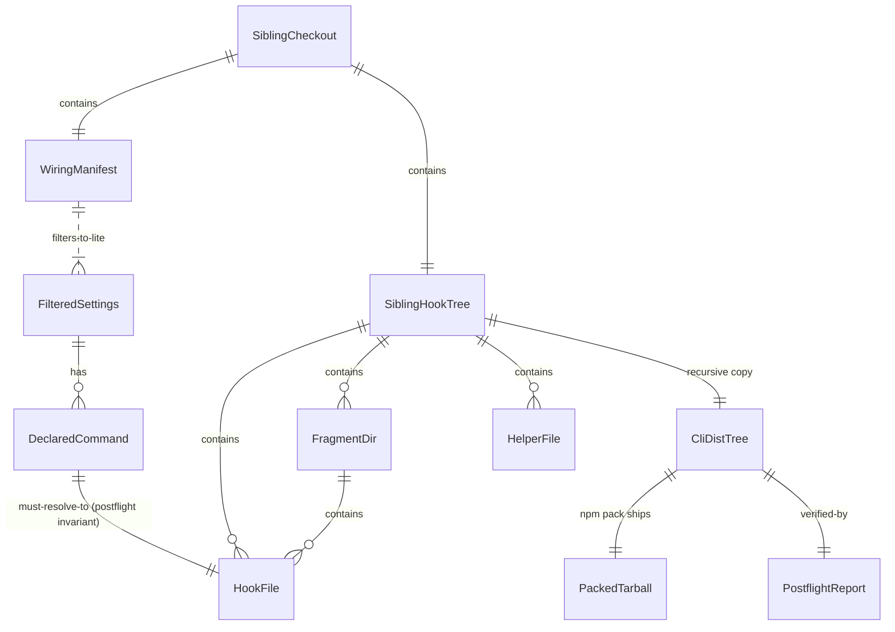

# IA model — cli 1.0.3 prepublish domain

## Sources read

- `docs/use-cases/UC-prepublish-recursive-hook-copy.md`
- `scripts/prepublish-bundle-substrate.mjs` — the current entity shapes
- `/tmp/bc-v0.42.0-check/bassclef/dist/lite/.claude/hooks/` — the SiblingHookTree structure

## Entity inventory

Objects the prepublish domain manipulates:

| Entity | Description | Lives at |
|---|---|---|
| `SiblingCheckout` | Cloned public bassclef at the pinned tag | `${BASSCLEF_SIBLING_ROOT}` |
| `WiringManifest` | JSON declaring per-tier hook wiring | `${sibling}/standards/bassclef-wiring-manifest.json` |
| `FilteredSettings` | The lite-tier subset of settings.json | Built in memory from WiringManifest |
| `SiblingHookTree` | Recursive tree of `*.sh` + `.d/` fragments | `${sibling}/dist/lite/.claude/hooks/` |
| `HookFile` | A single `*.sh` binary; POSIX mode + content | Leaf in SiblingHookTree |
| `FragmentDir` | A `*.d/` directory of fragments | Node in SiblingHookTree |
| `HelperFile` | A `.sh` sourced by other hooks (not a command) | Leaf in SiblingHookTree |
| `CliDistTree` | Cli's own dist output that npm packs | `${cwd}/dist/lite/.claude/hooks/` |
| `DeclaredCommand` | A `command` string in FilteredSettings pointing at a HookFile | In-memory Set |
| `PostflightReport` | Result of the last-check pass | Returned from `postflightDistLite` |
| `PackedTarball` | What `npm pack` produces | `${cwd}/thebassclef-lite-<version>.tgz` |

## Nav / container shape

```
SiblingCheckout                          CliRepo
  ├── standards/                           ├── scripts/
  │   └── bassclef-wiring-manifest.json    │   └── prepublish-bundle-substrate.mjs
  └── dist/lite/                           ├── src/
      └── .claude/                         ├── dist/lite/           <-- BUILT
          ├── settings.json                │   ├── .claude/
          └── hooks/                       │   │   ├── settings.json <-- from FilteredSettings
              ├── trace-helper.sh          │   │   └── hooks/        <-- from SiblingHookTree
              ├── session-reflection.sh    │   │       ├── trace-helper.sh
              ├── session-reflection.d/    │   │       ├── session-reflection.sh
              │   ├── fragment-a.sh        │   │       └── session-reflection.d/
              │   └── fragment-b.sh        │   │           ├── fragment-a.sh
              └── *.sh (~23 others)        │   │           └── fragment-b.sh
                                           │   └── standards/
                                           │       └── bassclef-wiring-manifest.json
                                           └── package.json      <-- version 1.0.3, files: dist/lite/**
```

## Labeling

- **Sibling** vs **Cli** — every path is named for its source-of-truth repo
- **Declared command** vs **Helper** vs **Fragment** — three roles a `*.sh` file can play; only the first is in settings.json
- **Copy** vs **Emit** — copy is byte-for-byte from sibling; emit is cli-generated (like the filtered settings.json)

## Screen map

Prepublish is a batch script, not a UI. The "screens" are stderr sections the operator reads when the build fails:

1. Manifest read section — `wiring manifest at ...`
2. Filter section — `filtered N hooks by tier ⊆ lite`
3. Copy section — `dist/lite/.claude/hooks/ received N files (M helpers, K fragments)`
4. Postflight section — `every declared command has a matching binary ✓` OR `MISSING: ...`

Each section is a stderr block; the operator reads bottom-up if the build failed.

## Relationships



## Findability rules (Morville)

- Any I/O failure names the offending path
- Any postflight miss names the offending declared command
- Any successful build logs the count of copied files broken down by kind (top-level, helper, fragment)

## Out of scope for IA

- Settings.json schema (owned by upstream)
- Wiring manifest schema (owned by upstream)
- The reader-side walker in `src/lib/copy-substrate.ts` (that's UC-init, this is UC-prepublish)
