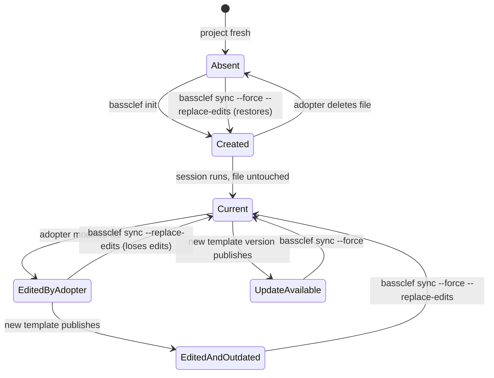
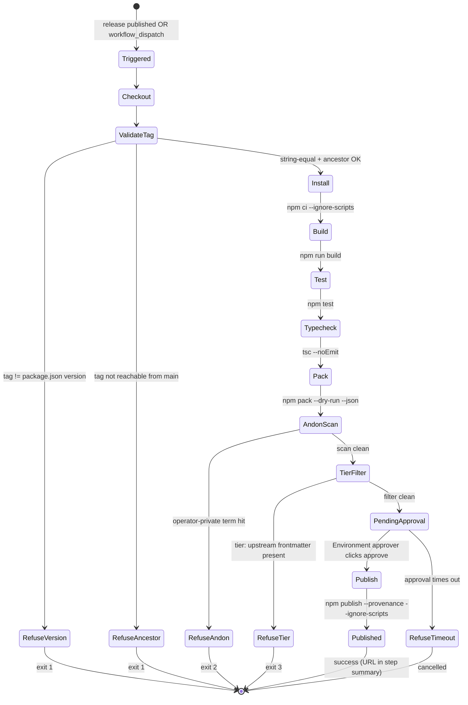
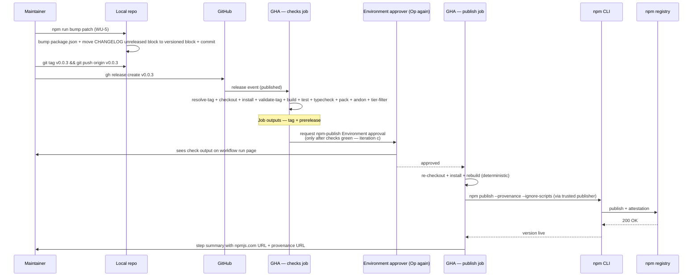

# Interaction design — `@thebassclef/core` npm distribution

Arc-level view of how adopters and maintainers touch the package. This doc formalizes the state and sequence diagrams that were drafted inline in per-WU decompositions (WU-2, WU-3, WU-4) and adds the missing arc-level view.

## Sources read

- `docs/iteration-bets/2026-08-06b-launch-npm-thebassclef-core.md`
- `docs/adrs/ADR-005-npm-distribution-architecture.md` (this doc's arc-level architecture)
- `docs/decompositions/wu-1-repo-shape.md` L47-99 (boundary + entity + control objects for the CLI)
- `docs/decompositions/wu-2-init.md` L149-236 (state + sequence diagrams for init)
- `docs/decompositions/wu-3-sync.md` L143-256 (state + sequence diagrams for sync)
- `docs/decompositions/wu-4-publish.md` L177-264 (state + sequence diagrams for publish)
- `package.json` (files whitelist + engines + bin + exports)

## Actors

| Actor | Role |
|---|---|
| **Sam** | Adopter. Runs `npm install -g @thebassclef/core` and `bassclef init`. Not a bassclef expert. Attention budget: 5 minutes on first install. |
| **Maintainer** | The person who tags a release. Runs `git tag` and clicks Environment approval. Persona of one today. |
| **bassclef CLI** | `bassclef` binary in `$PATH`. Dispatches to `init`, `sync`, `--version`, `--help`. |
| **npm registry** | Hosts `@thebassclef/core`. Sam pulls from it. GitHub Actions pushes to it. |
| **GitHub Actions** | Runs `.github/workflows/publish.yml` on release tag. |
| **bassclef-sync hook** | Separate user-scope shell hook at `~/.claude/hooks/bassclef-sync.sh`. Populates substrate content. Out of scope for this bet. |
| **bassclef repo** | Source of substrate content (skills / rules / hooks / luminaries / agents). Separate GitHub repo. |

## Jobs to be done (JTBD)

**Sam** — "When I want to add bassclef to my project, I want two commands that just work, so I can start using bassclef in five minutes without reading docs."

**Sam (later)** — "When a new @thebassclef/core version publishes, I want a safe upgrade that does not clobber the settings I edited."

**Maintainer** — "When I want to ship a new version, I want to tag a release and let the pipeline validate + publish, so I do not have to remember every safety check."

## Task flows (HTA — hierarchical task analysis)

**Sam's install flow:**
```
1. Install @thebassclef/core
    1.1. npm install -g @thebassclef/core
    1.2. verify: bassclef --version prints a version
2. Initialize a project
    2.1. cd project-dir
    2.2. bassclef init
    2.3. verify: three files exist under .claude/ and substrate.config.md
3. Set up user-scope bassclef-sync hook (out of scope for this bet; separate operator-time step)
```

**Sam's upgrade flow:**
```
1. Learn a new version is available (email, changelog, npm outdated)
2. Update
    2.1. npm install -g @thebassclef/core@latest
    2.2. cd project-dir
    2.3. bassclef sync
3. Review changes
    3.1. If sync reports "updated" — read what changed via `git diff`
    3.2. If sync reports "edited by you" — decide: keep edits, or run `--replace-edits`
```

**Maintainer's release flow:**
```
1. Decide bump size (patch / minor / major per WU-5 methodology)
2. Bump version
    2.1. npm run bump patch (or minor / major)
    2.2. verify: package.json version updated + CHANGELOG entry moved
3. Tag and release
    3.1. git tag vX.Y.Z
    3.2. git push origin vX.Y.Z
    3.3. gh release create vX.Y.Z
4. Approve publish
    4.1. Wait for GitHub Actions to fire the workflow
    4.2. Click "approve" on the npm-publish Environment
5. Verify
    5.1. Check npmjs.com for the new version
    5.2. Read the provenance attestation link
```

## Entity model

| Entity | Owner | Notes |
|---|---|---|
| Package version | package.json + built-in constant | Read by tag validator. String equality at publish. |
| Init manifest | `.bassclef/init.manifest.json` in adopter project | Written by init. Read + updated by sync. Content-hashed per file. |
| Templates | TypeScript string constants under `src/commands/init-templates/` | Compiled INTO `dist/cli.js`. Zero runtime disk read. |
| Content hash | SHA-256 per file | Sync compares current file hash vs manifest hash to detect adopter edits. |
| Git tag | git | Read by workflow via `github.event.release.tag_name` (release event) or `inputs.tag` (workflow_dispatch); see `.github/workflows/publish.yml` L40-46. String-equal to package.json version. |
| Trusted publisher config | npmjs.com (out of band) | Consumed by publish step. Replaces NPM_TOKEN. |
| Provenance attestation | npm registry | Auto-generated by npm CLI on publish. |
| Andon term list | inline in `scripts/andon-scan.mjs` | Read at scan time. Refuses on match. |
| Tier frontmatter | any shipped file's YAML frontmatter | Read by tier-filter. Refuses on `tier: upstream`. |

## State diagrams

### Adopter's project directory — per-file state after init or sync



### Package version — semver progression (WU-5 governs the transitions)

```mermaid
stateDiagram-v2
    [*] --> Unpublished: 0.0.1 reserved on npm at package name registration
    Unpublished --> Published_0_0_2: first tagged release (WU-9)
    Published_0_0_2 --> Published_0_0_X: patch bump (bug fix)
    Published_0_0_X --> Published_0_Y_0: minor bump (backward-compatible feature)
    Published_0_Y_0 --> Published_1_0_0: major bump (breaking change; unscoped `bassclef` transfer OR adopter cohort >=25 per we-don't-break-adopters)
    Published_0_0_X --> Published_0_0_X_next: pre-release tag (`0.0.3-rc.1` publishes to npm dist-tag `next`)
```

### Publish workflow — one linear state machine



## Sequence diagrams

### End-to-end adopter journey

```mermaid
sequenceDiagram
    participant Sam as Sam (adopter)
    participant NPM as npm registry
    participant CLI as bassclef CLI
    participant Proj as Sam's project dir
    participant Sync as bassclef-sync hook<br/>(user-scope; separate install)
    participant BSC as sunj-labs/bassclef<br/>(substrate source)

    Note over Sam,BSC: Install — once per machine
    Sam->>NPM: npm install -g @thebassclef/core
    NPM-->>Sam: bassclef binary in PATH

    Note over Sam,BSC: Init — once per project
    Sam->>CLI: cd my-project && bassclef init
    CLI->>Proj: write .claude/settings.json
    CLI->>Proj: write substrate.config.md
    CLI->>Proj: write .bassclef/init.manifest.json
    CLI-->>Sam: "3 created" + next steps

    Note over Sam,BSC: Session start — every time Sam runs claude
    Sam->>Proj: claude
    Proj->>Sync: SessionStart hook fires
    Sync->>BSC: fetch current substrate release
    BSC-->>Sync: skills / rules / hooks / agents
    Sync-->>Proj: ~/.claude/skills/*/SKILL.md ready

    Note over Sam,BSC: Upgrade — when a new version ships
    Sam->>NPM: npm install -g @thebassclef/core@latest
    Sam->>CLI: bassclef sync
    CLI->>Proj: read .bassclef/init.manifest.json
    CLI->>Proj: hash current templates vs new
    alt template newer, adopter did not edit
        CLI->>Proj: write updated templates
        CLI-->>Sam: "2 updated"
    else adopter edited
        CLI-->>Sam: "edited by you — run --replace-edits to overwrite"
    end
```

### Maintainer's release flow



## Boundary contracts

| Boundary | What crosses it | Contract |
|---|---|---|
| Sam's shell to `bassclef` binary | `argv` | Verbs: `init`, `sync`, `--version`, `--help`. Unknown → exit 3. |
| `bassclef init` to filesystem | Three files under target directory | Fail-safe defaults. `--force` required to overwrite. `O_NOFOLLOW` at open time. See ADR-002. |
| `bassclef sync` to filesystem | Same three files | Two independent force flags: `--force` (version outdated) + `--replace-edits` (adopter edits). See ADR-003. |
| Local git to GitHub Actions | Git tag event | Tag must be reachable from main. Tag must string-equal package.json version. See ADR-004. |
| GitHub Actions to npm registry | HTTPS request | Trusted publisher only. No NPM_TOKEN. Provenance auto-generated. |
| npm registry to Sam's machine | Package tarball | `files` whitelist per package.json. Contents: `dist/`, `README.md`, `LICENSE`. Nothing else. |

## What this doc does NOT cover

- Substrate content flow (Road 2 per ADR-005) — separate design owned by bassclef repo.
- Kilo runtime integration — Phase 2 per bet L168.
- MCP server — out of scope per bet.
- Second-tier or ultra-tier packages — out of scope per bet L172.

## Composes with

- ADR-005 — architecture-level decisions this doc gives the interaction shape for
- ADR-001..004 — per-WU pins referenced in each state / sequence diagram
- `docs/decompositions/wu-*.md` — per-WU inline diagrams this doc consolidates
- `docs/use-cases/UC-init.md`, `UC-sync.md`, `UC-script-publish.md` — Cockburn use cases per `oo-ad-entry-point.md` (authored alongside this doc)
- `.claude/luminaries/alan-cooper.md` — Sam persona lens
- `.claude/luminaries/don-norman.md` — feedback + signifier lens on the CLI output shape
- `.claude/luminaries/john-ousterhout.md` — deep-module lens on the two-road split
