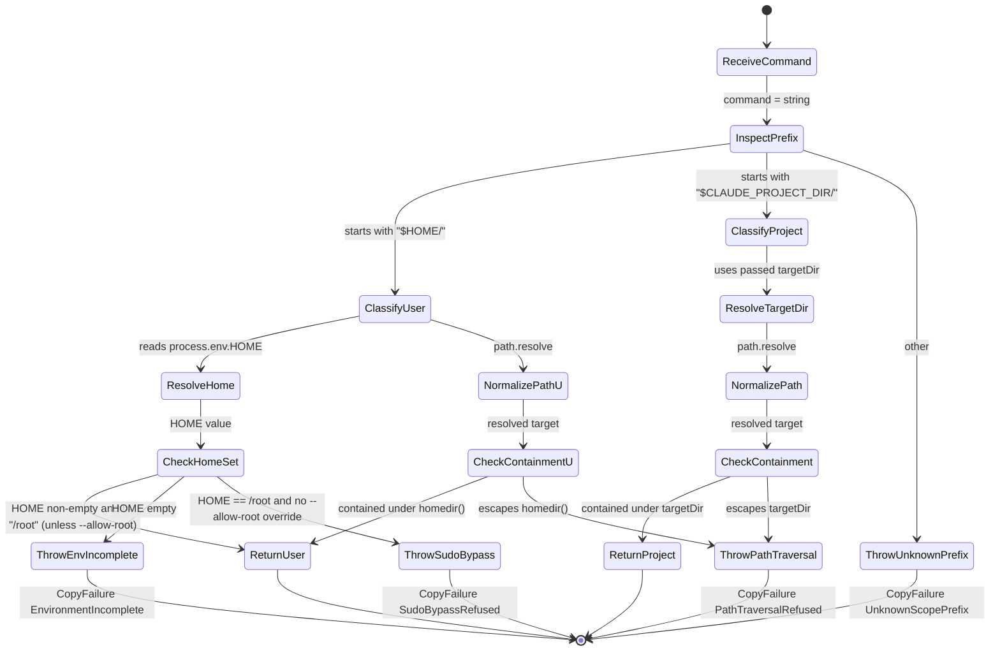

# Interaction design — cli 1.0.1 hook routing

Sequence diagrams from `UC-init-walker-hook-routing`. Every extension in the use case appears here as an alt-block or a separate diagram, so Step 5 GRASP decomposition reads a full call graph.

## Sources read

- `docs/use-cases/UC-init-walker-hook-routing.md` — main scenario + 12 extensions this diagram renders
- `docs/decompositions/2026-09-13d-cli-1-0-1-hook-routing-domain.md` — 4 actors + Control classes (InitDispatcher, InitWalker, ScopeRouter, ExecutableBitEnforcer, SymlinkRefuser, PlaceholderTransform)
- `docs/risk-ledgers/2026-09-13d-cli-1.0.1-hook-routing.md` — failure paths per lens

## What I'm NOT reading (with reason)

- Individual hook binary contents — opaque to the sequence
- Full ADR-002 exit code table — already extracted into the use case

## Diagram 1 — Main success scenario

The happy-path sequence a cold adopter walks through on `bassclef init` for cli 1.0.1.

```mermaid
sequenceDiagram
    autonumber
    actor ColdAdopter
    participant CLI as bassclef CLI
    participant Dispatch as InitDispatcher
    participant Walker as InitWalker
    participant Router as ScopeRouter
    participant WS as writeSafely (SymlinkRefuser)
    participant Chmod as ExecutableBitEnforcer
    participant FS as Filesystem
    actor CC as ClaudeCodeSession

    ColdAdopter->>CLI: bassclef init
    CLI->>Dispatch: parseInitArgs + resolveTargetDir
    Dispatch->>Dispatch: shouldRefuseRoot check
    Dispatch->>Walker: copySubstrate(targetDir, {transform})
    Walker->>FS: readWiringManifest
    FS-->>Walker: schema_version = 2.0.0
    Walker->>Walker: walkDistTree(bundleRoot) sorted
    Walker->>FS: read dist/lite/.claude/settings.json
    FS-->>Walker: 6 event blocks, 24 hook commands
    loop for each file in bundle
        alt file is a hook (dist/lite/.claude/hooks/*.sh)
            Walker->>Router: classifyScope(hookCommand)
            Router-->>Walker: user | project (based on $HOME vs $CLAUDE_PROJECT_DIR)
            Walker->>WS: write(target, content, {force})
            WS->>FS: lstat(target)
            FS-->>WS: not a symlink; not existing
            WS->>FS: writeFileSync(target, content)
            WS-->>Walker: ok
            Walker->>Chmod: setExecutable(target)
            Chmod->>FS: chmodSync(target, 0o755)
            FS-->>Chmod: ok
            Chmod-->>Walker: ok
        else file is a template (CLAUDE.md, whereami.md, .bassclef-source.json)
            Walker->>Walker: PlaceholderTransform(content)
            Walker->>WS: write(target, transformed, {force})
            WS-->>Walker: ok
        else file is settings.json or other verbatim
            Walker->>WS: write(target, content, {force})
            WS-->>Walker: ok
        end
    end
    Walker-->>Dispatch: CopyResult {copied:24, refused:0, errored:0, wiringVersion:"2.0.0", hookCount:24}
    Dispatch->>Dispatch: compare copied vs declared hookCount
    Dispatch->>ColdAdopter: banner "24 hooks armed (lite tier)"
    Dispatch->>FS: writeManifest with scope tags
    Dispatch-->>CLI: exit 0
    Note over ColdAdopter,CC: Cold adopter opens Claude Code in the initialized repo
    CC->>FS: read .claude/settings.json
    FS-->>CC: 6 event blocks resolved
    CC->>FS: invoke $HOME/.claude/hooks/bassclef-sync.sh
    FS-->>CC: exec bit set; hook runs
    CC->>FS: invoke $CLAUDE_PROJECT_DIR/.claude/hooks/plain-english-steering.sh
    FS-->>CC: exec bit set; hook runs
    CC-->>ColdAdopter: session ready, zero hook-not-found errors
```

## Diagram 2 — Extension paths (failure classes)

Extension IDs match UC-init-walker-hook-routing. Each `alt` block shows a distinct failure path.

```mermaid
sequenceDiagram
    autonumber
    participant Dispatch as InitDispatcher
    participant Walker as InitWalker
    participant Router as ScopeRouter
    participant WS as writeSafely
    participant Chmod as ExecutableBitEnforcer
    participant FS as Filesystem

    Dispatch->>Walker: copySubstrate(...)
    alt Ext 1a — $HOME unset
        Walker->>Walker: check process.env.HOME
        Walker-->>Dispatch: throw CopyFailure{kind:"EnvironmentIncomplete"}
        Dispatch->>Dispatch: log stderr "set HOME before running init"
        Dispatch-->>Dispatch: exit 1
    else Ext 1c — --allow-root but $HOME=/root
        Walker->>Walker: detect HOME=/root
        Walker-->>Dispatch: throw CopyFailure{kind:"SudoBypassRefused"}
        Dispatch->>Dispatch: log stderr
        Dispatch-->>Dispatch: exit 1
    else Ext 3a — wiring manifest schema major mismatch
        Walker->>FS: readWiringManifest
        FS-->>Walker: schema_version = 3.0.0
        Walker-->>Dispatch: throw CopyFailure{kind:"SchemaIncompatible"}
        Dispatch-->>Dispatch: exit 5
    else Ext 5a — declared hook missing from bundle
        Walker->>FS: read dist/lite/.claude/hooks/missing.sh
        FS-->>Walker: ENOENT
        Walker->>Walker: append to result.errored
        Note over Walker: continues with remaining hooks
    else Ext 5b — third scope prefix (unknown to walker)
        Walker->>Router: classifyScope("$XDG_DATA_HOME/...")
        Router-->>Walker: throw CopyFailure{kind:"UnknownScopePrefix"}
        Walker-->>Dispatch: propagate
        Dispatch-->>Dispatch: exit 5
    else Ext 6a — symlink at user-scope target
        Walker->>WS: write($HOME/.claude/hooks/x.sh, ...)
        WS->>FS: lstat
        FS-->>WS: is symlink
        WS-->>Walker: throw WriteError{kind:"SymlinkRefused"}
        Walker->>Walker: append to result.refused
        Note over Walker: continues; final exit 2 if any refused
    else Ext 6c — existing file at user-scope target (no --force)
        Walker->>WS: write($HOME/.claude/hooks/x.sh, ...)
        WS->>FS: lstat
        FS-->>WS: existing file
        WS-->>Walker: throw WriteError{kind:"AlreadyExists"}
        Walker->>Walker: append to result.refused
    else Ext 6d — chmod fails on non-POSIX
        Walker->>WS: write ok
        Walker->>Chmod: setExecutable(target)
        alt platform is win32
            Chmod->>Chmod: skip chmod; INFO stderr
            Chmod-->>Walker: ok
        else platform is posix and chmod errors
            Chmod-->>Walker: throw
            Walker->>Walker: append to result.errored
        end
    else Ext 6e — path traversal (defensive)
        Walker->>Router: resolveTarget("...../etc/passwd")
        Router->>Router: path.resolve + containment check
        Router-->>Walker: throw CopyFailure{kind:"PathTraversalRefused"}
        Walker-->>Dispatch: propagate
        Dispatch-->>Dispatch: exit 2
    else Ext 8a — declared hookCount != copied hookCount
        Walker-->>Dispatch: CopyResult{copied:22, refused:2}
        Dispatch->>Dispatch: compare 22 (copied) vs 24 (declared)
        Dispatch->>Dispatch: log "22 of 24 hooks armed (lite tier)"
        Dispatch-->>Dispatch: exit 2
    else Ext 10a — second init run without --force
        Note over Walker: every user-scope target hits Ext 6c
        Note over Walker: every project-scope target hits UC-init AlreadyExists
        Walker-->>Dispatch: CopyResult{copied:0, refused:24}
        Dispatch-->>Dispatch: exit 2
    end
```

## Diagram 3 — ScopeRouter decision state

State diagram for the new `ScopeRouter` control class. Reads a single settings.json command; returns a scope decision or throws.



## Notes

- **Sequence diagrams are the primary artifact for Step 5 GRASP.** Every Control class in the domain decomposition (InitDispatcher, InitWalker, ScopeRouter, ExecutableBitEnforcer, SymlinkRefuser, PlaceholderTransform) appears as a participant here with defined message sends. GRASP reads message sends to assign Information Expert, Controller, Creator, Low Coupling, and High Cohesion responsibilities.
- **The main scenario (Diagram 1) shows only the happy path.** The 12 extensions from the use case render as alt-blocks in Diagram 2. Together they cover every branch a Feathers characterization test needs to pin.
- **The state diagram (Diagram 3) covers the new ScopeRouter class explicitly.** State machine shape helps Step 5 identify pattern candidates — Strategy (per-prefix routing), Guard (containment checks), Chain of Responsibility (prefix inspection → path resolution → containment).
- **Diagrams stay Cockburn-compatible.** Every arrow maps back to a UC step or extension line; nothing here invents new behavior. If the sequence disagrees with the use case, the use case wins and the diagram gets amended.

## References

- Use case: `docs/use-cases/UC-init-walker-hook-routing.md`
- Domain decomposition: `docs/decompositions/2026-09-13d-cli-1-0-1-hook-routing-domain.md`
- Risk ledger v1: `docs/risk-ledgers/2026-09-13d-cli-1.0.1-hook-routing.md`
- Downstream: Step 5 GRASP decomposition (`docs/decompositions/2026-09-13d-cli-1-0-1-hook-routing-grasp.md`)
