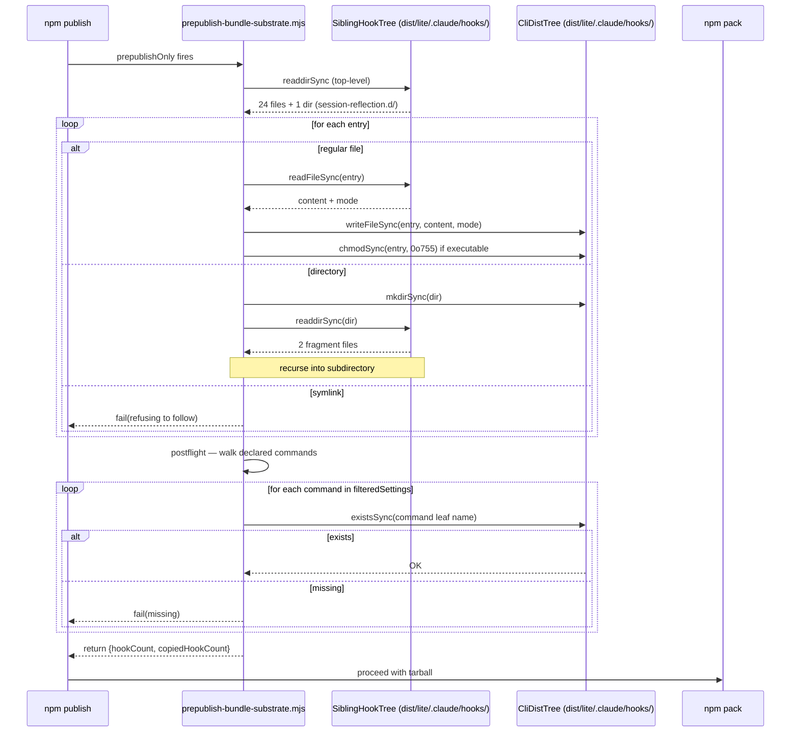
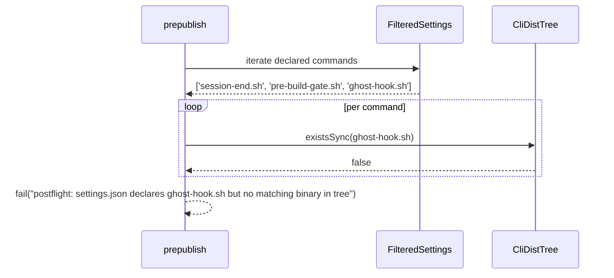

# Interaction design — cli 1.0.3 prepublish

## Sources read

- `docs/use-cases/UC-prepublish-recursive-hook-copy.md` — main + extensions
- `docs/ia-models/2026-09-16-cli-1.0.3-prepublish.md` — entities the diagrams reference

## State diagram

```mermaid
stateDiagram-v2
  [*] --> BuildStart : npm publish triggers prepublish
  BuildStart --> ManifestLoad : loadWiringManifest
  ManifestLoad --> ManifestBad : parse fail OR missing
  ManifestBad --> [*] : fail(reason)
  ManifestLoad --> TierFilter : filterHooksByTier('lite')
  TierFilter --> SettingsWrite : emitDistLiteSettings
  SettingsWrite --> TemplatesCopy : copyDistTemplates
  TemplatesCopy --> ManifestCopy : copyWiringManifestIntoDist
  ManifestCopy --> HookTreeCopy : copyHookBinaries (RECURSIVE, new)
  HookTreeCopy --> HookTreeMissing : sibling hooks dir absent
  HookTreeMissing --> [*] : fail(remediation)
  HookTreeCopy --> HookTreeEmpty : zero *.sh under sibling
  HookTreeEmpty --> [*] : fail(pre-v0.42.0)
  HookTreeCopy --> HookTreeSymlink : lstat detects symlink
  HookTreeSymlink --> [*] : fail(refusing to follow)
  HookTreeCopy --> HookTreeIOError : read or write fails
  HookTreeIOError --> [*] : fail(path + errcode)
  HookTreeCopy --> Postflight : all copies OK
  Postflight --> CommandMissing : declared command lacks binary
  CommandMissing --> [*] : fail(missing name)
  Postflight --> BuildOK : every declared command has binary
  BuildOK --> [*] : return hookCount to caller; npm pack proceeds
```

## Sequence diagram — happy path

## Sequence diagram — postflight declared-command miss

## Interaction rules

- **No prompts.** Prepublish is batch. If a decision would need input, `fail()` instead.
- **All errors carry the offending path** plus a one-line remediation
- **Success is quiet.** One-line summary at the end: `dist/lite/.claude/hooks/ received 26 files (24 top-level + 2 fragments)`
- **No retry.** Fail once, exit. `npm publish` will not proceed.

## Traces to Business rules (from UC)

- State `HookTreeSymlink` → UC extension 3a
- State `CommandMissing` → UC extension 5a
- State `HookTreeMissing` → UC extension 1a
- State `HookTreeEmpty` → UC extension 1b
