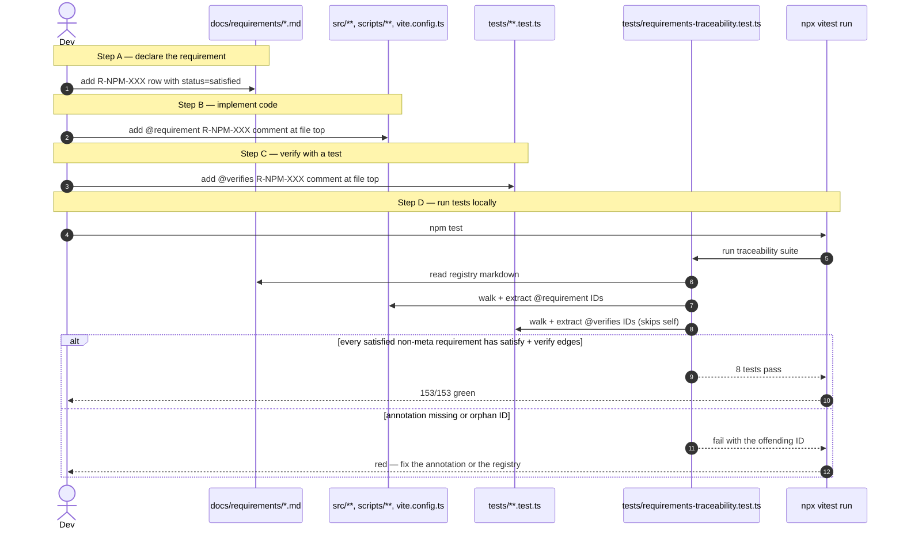
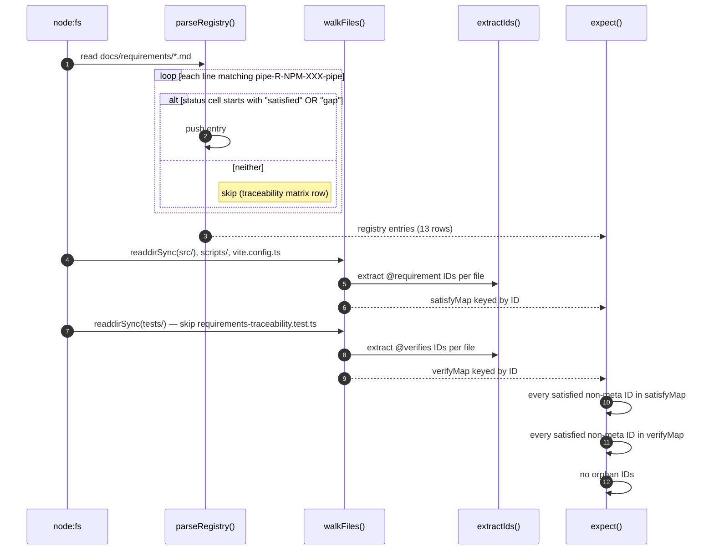

# /promote — Traceability Subsystem + 5 luminaries for requirements engineering

**Problem (≤500 chars):** Bassclef adopters ship code, ADRs, use cases, decompositions, and tests, but nothing links the requirement → design → code → test chain into one graph a reader can see or a machine can walk. When a code change breaks a documented invariant, no gate fires — the drift is found by audit weeks later. Every adopter reproduces the same audit cost. The change we want is a Traceability Subsystem as a first-class substrate primitive, so requirement changes propagate through the chain automatically.

---

## Goal

Add three things to bassclef substrate:

1. A **Traceability Subsystem** — schema + notation + accessors + hooks — that lets adopters link requirements to design, design to code, and code to tests, and get impact-analysis + regression scoping + scope-creep defense for free.
2. Five new **luminaries** anchoring the discipline: Dr. Jane Cleland-Huang, Dr. Orlena Gotel, Dr. Patrick Mäder, Dr. Alexander Egyed, Dr. Jane Huffman Hayes.
3. An **`@requirement` code annotation rule**, analog to `@pattern`, that marks source files with the requirement IDs they satisfy.

## Evidence

- Source: `docs/whereami.md` L91-95 (bassclef-cli). Warrant: names the 5 sister OOAD promotes (#1167-1171) that surfaced the "OOAD produces artifacts nothing consumes at engineering time" gap. This promote extends that observation to the requirements → verification chain.
- Source: `docs/iteration-bets/2026-08-06b-launch-npm-thebassclef-core.md` L152-164. Warrant: acceptance items are top-level requirements written in prose. Nothing today links them to the ADR that pins their contract, the UC that specifies their behavior, the source that implements them, or the test that verifies them.
- Source: session log `chore/ooad-audit-2026-08-11` (this branch). Warrant: an audit of 5 ADRs + 4 UCs + 1 interaction design doc + 4 scripts + 1 workflow surfaced 20 drift items across ~5 days of work. Every one is a link that would have fired a gate if traceability was mechanical.
- Source: `.claude/rules/pattern-annotation.md` (existing bassclef substrate). Warrant: the `@pattern` rule already establishes the precedent for code-level markers pointing at catalog files. The `@requirement` rule mirrors that shape.

## Sources read

- `docs/whereami.md` L23, L91-95
- `docs/iteration-bets/2026-08-06b-launch-npm-thebassclef-core.md` L152-164
- `docs/adrs/ADR-001..005-*.md` (5 files)
- `docs/interaction-design/2026-08-08-npm-distribution.md`
- `docs/use-cases/UC-init.md`, `UC-sync.md`, `UC-script-bump.md`, `UC-script-publish.md`
- `.claude/rules/pattern-annotation.md` (analog rule; catalog-annotation shape)
- `.claude/rules/oo-ad-entry-point.md` (sister OOAD discipline)
- `.claude/luminaries/john-ousterhout.md`, `martin-fowler.md`, `michael-feathers.md` (composition candidates)
- SysML Requirement Diagram specification (external — see References)

---

## Part 1 — Architecture + structural foundations

The subsystem operationalizes the SysML Requirement Diagram into digital software constraints. It enforces four semantic relationships across artifacts.

### Relationships (SysML notation names, adopted verbatim)

| Relationship | What it links | Where it lives |
|---|---|---|
| «containment» | parent requirement contains child | frontmatter `parent_requirement: R-XXX` on child docs |
| «deriveReqt» | technical requirement derived from a higher-level requirement | frontmatter `derives_from: [R-YYY]` on ADR + spec docs |
| «verify» | test verifies a requirement | frontmatter `verifies: [R-XXX, ADR-NNN §Y]` on test files |
| «satisfy» | code satisfies a requirement | `@requirement R-XXX` code annotation on source files |
| «refine» | design doc refines a requirement | frontmatter `refines: [R-XXX]` on UC + decomposition + interaction-design docs |

### Requirement IDs

- **Format:** `R-<domain>-<NNN>` where domain is a 3-4 letter tag (e.g., `R-INIT-001`, `R-SYNC-042`, `R-PUB-007`).
- **Registry:** `docs/requirements/registry.md` per adopter repo — one row per requirement, one column per canonical field (id, title, parent, source_bet, source_ticket, status, verified_by).
- **Substrate-level catalog:** bassclef substrate ships zero requirements. Requirements are always adopter-owned. The substrate ships the primitive layer only.

### Graph shape

Nodes: `Requirement` (R-…), `ADR` (ADR-NNN), `UseCase` (UC-…), `Decomposition` (docs/decompositions/*), `Source` (src/**/*), `Test` (tests/**/*), `Workflow` (.github/workflows/*).

Edges: the 5 SysML relationships above.

Storage: extend the state spine per bassclef standards/state-spine.md — a `requirements/` entity type, JSON-Schema-validated frontmatter, forward + reverse indexes auto-built by hook on Edit/Write.

## Part 2 — Maintenance + system lifecycle behaviors

Three behaviors adopters get for free once the subsystem ships.

### 1. Impact analysis on code change

When source at path `src/foo.ts` changes:

- Hook traverses `@requirement` annotations on the file.
- For each requirement, walks `«satisfy»` and `«refine»` edges reverse to find upstream ADRs, UCs, requirements.
- For each requirement, walks `«verify»` forward to find test files.
- Emits a report at `state/markers/impact-analysis/<branch>.md` — one section per requirement affected, one line per upstream + downstream node.

The audit tonight would have taken 5 minutes with this in place. Every affected doc + test surfaced by name.

### 2. Regression test scoping

When Vitest runs in CI-scoped mode:

- Read staged/changed files.
- Look up `@requirement` annotations.
- Look up `verifies:` frontmatter on test files pointing at those requirements.
- Run only those tests.
- Fallback to full suite when annotations missing (safe default).

Cost saving on repos with big test suites is large. Small on bassclef-cli today (27 tier 0 tests). Compounds as the codebase grows.

### 3. Scope-creep defense

When a new feature PR opens:

- Hook parses PR body for a `Refines: R-XXX` or `Derives-from: R-YYY` line.
- Validates that R-XXX exists in the registry.
- If absent → BLOCKED per `.claude/rules/blocked-items.md` protocol. The PR either names a parent requirement OR files a new requirement first OR carries an explicit `SKIP_SCOPE_CREEP=1` override.

This is the sister to bassclef's existing bet-doc discipline. The bet is a top-level requirement container; this rule extends the discipline to per-PR granularity.

## Part 3 — Theoretical foundations + 5 luminaries

Five new luminary files land alongside the primitive layer. Each carries a stub-tier entry per bassclef#867 pattern with frontmatter + 4-section body grounded in primary source. Full-body deferred to a per-luminary follow-on.

### Luminary stubs proposed

**1. Dr. Jane Cleland-Huang — Event-Based Traceability + automation**
- Slug: `jane-cleland-huang`
- Primary source: *Event-Based Traceability for Managing Evolutionary Change* (IEEE TSE, 2003) + *Software and Systems Traceability* (Springer, 2012, editor)
- Discipline anchor: EBT loops — automatically generate, monitor, repair trace links using Information Retrieval + machine learning as the codebase evolves.
- Composes with: Andrej Karpathy (retrieval side), Michael Feathers (safety net)
- Cited by: future `/impact-analyze` skill; `.claude/hooks/trace-link-decay-check.sh`

**2. Dr. Orlena Gotel — Pre/Post traceability taxonomy**
- Slug: `orlena-gotel`
- Primary source: *An Analysis of the Requirements Traceability Problem* (1994) + *Grand Challenges in Traceability* (Springer, 2012)
- Discipline anchor: Pre-Requirements Traceability (elicitation history, stakeholder requests, journal entries) vs Post-Requirements Traceability (specification → code → deployment). Two separate database axes.
- Composes with: Ash Maurya (lean canvas — pre-side elicitation), Alistair Cockburn (use case — post-side specification)
- Cited by: state-spine schema — Requirement entity carries `elicitation_source` + `verification_evidence` as distinct arrays.

**3. Dr. Patrick Mäder — Developer velocity + traceability UX**
- Slug: `patrick-maeder`
- Primary source: *Do Developers Benefit from Requirements Traceability?* (empirical study, ICSE 2014) + follow-on work
- Discipline anchor: traceability tools succeed only when developer velocity increases. Design telemetry to prove the tool reduces maintenance errors + speeds code exploration.
- Composes with: Alan Cooper (Sam persona on developer as user), Donald Norman (feedback loops)
- Cited by: `/impact-analyze` skill output shape — sorted by developer-time-saved estimate; a `state/markers/trace-usage/` telemetry surface.

**4. Dr. Alexander Egyed — Consistent reflexive tracing**
- Slug: `alexander-egyed`
- Primary source: *A Scenario-Driven Approach to Trace Dependency Analysis* (IEEE TSE, 2003) + *Instant Consistency Checking for the UML* (ICSE 2006)
- Discipline anchor: real-time transitive consistency checking. When visual models or source change, compute multi-step structural changes across the graph in real time. Not batch; not periodic; instant.
- Composes with: John Ousterhout (information hiding — the graph edges hide the transitive walk from callers), Alistair Cockburn (use case — as the concrete input)
- Cited by: hook on Edit/Write that re-computes the impact graph fragment; standards for graph-store consistency.

**5. Dr. Jane Huffman Hayes — Validation metrics + false-negative reduction**
- Slug: `jane-huffman-hayes`
- Primary source: *Advancing candidate link generation for requirements tracing* (IEEE TSE, 2006) + *REquirements TRacing On target* (RETRO tool)
- Discipline anchor: automated text mining + established dataset benchmarks. Continuously reduce false negatives (missed linkages) during code reviews + security audits.
- Composes with: Kent Beck (TDD — tests catch what the trace missed), Michael Feathers (characterization tests — safety net)
- Cited by: benchmark harness for `/trace-verify` skill; regression tests over the impact-analysis engine itself.

---

## Phase 1 evidence — applied test case ships enforcement (added 2026-08-12)

The filing repo (bassclef-cli) shipped Phase 1.5 as iteration d on 2026-08-11 (PR #17 merged as commit 77c2817). The shape below is the working example bassclef-upstream reviewers can react to. The 5 luminaries + rules proposed in Phase 1 sit downstream of what the applied test case already demonstrates.

**Author flow** — what a developer does to add or change a satisfied requirement, and how the test catches missing annotations.



**Test implementation** — algorithm inside `tests/requirements-traceability.test.ts`.



**CI wiring** — where the test fires in the publish workflow.

```mermaid
sequenceDiagram
    autonumber
    actor Dev
    participant GitHub
    participant Checks as workflow — checks job
    participant Vitest as npm test
    participant TraceTest as requirements-traceability.test.ts
    participant Approver as Env approver
    participant Publish as workflow — publish job

    Dev->>GitHub: push commit OR create release tag
    GitHub->>Checks: trigger workflow

    Checks->>Vitest: npm test (among other checks)
    Vitest->>TraceTest: run 8 traceability tests
    alt all annotations complete
        TraceTest-->>Vitest: pass
        Vitest-->>Checks: 153/153 pass
    else drift
        TraceTest-->>Vitest: fail
        Vitest-->>Checks: red
        Checks-->>GitHub: workflow red; nothing publishes
        GitHub-->>Dev: fix the annotation, push again
    end

    Note over Checks: checks job green
    Checks->>Approver: request npm-publish Environment approval
    Approver->>Approver: view check output on run page
    Approver->>Publish: click approve
    Publish->>Publish: re-checkout + install + build
    Publish->>Publish: npm publish --provenance
    Publish-->>Dev: step summary with npmjs.com URL
```

**Numbers from the applied test case (as of 2026-08-11):**

- 8 tests in `tests/requirements-traceability.test.ts`.
- 8 source files carry `@requirement R-NPM-XXX` annotations.
- 7 test files carry `@verifies R-NPM-XXX` annotations.
- 1 meta-requirement exemption (R-NPM-012 — All Tier 0 tests GREEN).
- 153/153 total tests pass.
- CI enforcement lives on the workflow `checks` job via `npm test`.

Phase 2 of the plan below adds accessors + hook that extend this shape substrate-wide.

**Phase 2 concrete-shape evidence (added 2026-08-12):** The proposed substrate hook is drafted at `docs/proposed-substrate-hooks/requirement-annotation-check.md` in bassclef-cli. It specifies the PreToolUse Edit / Write / MultiEdit handler, the classification (source vs test vs registry), the checks per class, the failure format, the override paths, the sibling composition with `pattern-annotation-validate.sh` + `assert-verify-steering.sh`, a runnable-in-principle bash sketch, and the Tier 0 test cases. Substrate reviewers can react to concrete design before the substrate PR opens. Also documented in bassclef-cli — git pre-commit hook that bridges the gap between iteration d's CI Vitest and Phase 2's substrate hook (`scripts/pre-commit-traceability.sh`, PR #21).

---

## Phased plan

### Phase 1 — Methodology + reference model (this promote's V1)

Ships:
- The 5 luminary files under `.claude/luminaries/` (stub-tier per bassclef#867)
- `.claude/rules/requirement-annotation.md` — code annotation rule (analog of `pattern-annotation.md`)
- `.claude/rules/traceability-frontmatter.md` — frontmatter contract for `verifies:`, `refines:`, `derives_from:`, `parent_requirement:` fields
- `standards/traceability-subsystem.md` — the full reference document (relationship names, ID format, registry shape, graph shape)
- `templates/requirement-registry-template.md` — starter for adopter repos

Cost: ~200-400 turns for a scoped author-and-ship. Methodology layer only. Zero automation.

**Acceptance:**
- 5 luminary files land with verified sources cited
- 3 new rules load via `additionalDirectories` at session start
- 1 new standard doc references all 3 rules + the 5 luminaries
- The bassclef-cli repo (this filer) demonstrates the pattern in `docs/requirements/2026-08-11-npm-distribution.md`

### Phase 2 — State-spine extensions + accessors + hook

Ships:
- Requirement entity type added to `standards/state-spine.md` per bassclef schema-validation discipline
- `lib/state.sh` gains `state_requirement_get`, `state_requirement_list`, `state_requirement_verifies` accessors
- **New hook — `.claude/hooks/requirement-annotation-check.sh`** — PreToolUse Edit / Write / MultiEdit on `src/**`, `scripts/**`, `tests/**`, `vite.config.ts`, `tsconfig.json`, and `docs/requirements/*.md`. Blocks writes that break the annotation chain — orphan IDs, removing a sole satisfier, flipping GAP → satisfied without paired annotations. Concrete spec drafted at `docs/proposed-substrate-hooks/requirement-annotation-check.md` in bassclef-cli (iteration h, PR pending). The spec includes bash implementation sketch, Tier 0 test cases, sibling composition (with `pattern-annotation-validate.sh` and `assert-verify-steering.sh`), override paths.
- Optional second hook — `.claude/hooks/traceability-index-build.sh` — PreToolUse rebuild of forward + reverse indexes (deferred; the check hook covers immediate needs).
- New skill: `/impact-analyze <path>` — walks the graph, emits impact report at `state/markers/impact-analysis/<branch>.md`
- Tier 0 tests on the accessor + the hook per `.claude/rules/testing-tier-config.md`

Cost: substantive substrate work. Estimate deferred until Phase 1 lands and calibrates.

**Acceptance:**
- `requirement-annotation-check.sh` fires on adopter Edit / Write per the spec; blocks orphan IDs and sole-satisfier removals
- Impact analysis produces correct upstream + downstream node lists on a fixture repo
- Accessors pass state-spine schema validation
- Hook fires idempotently; index rebuild is under 200ms on repos with under 1000 nodes
- Adopter can drop in the primitive layer with zero config beyond adding requirements

### Phase 3 — Automated impact + EBT (research-grade; deferred)

Ships:
- Cleland-Huang EBT loop — Information Retrieval + machine learning to auto-generate + monitor + repair trace links as code evolves
- Egyed's transitive consistency engine — multi-step structural changes computed on Edit/Write
- Hayes's benchmark harness — false-negative measurement against curated dataset

Cost: research-grade. Multi-quarter. Deferred to a future roadmap.

**Acceptance:** deferred.

---

## Composes with existing bassclef substrate

- **`.claude/rules/pattern-annotation.md`** — the shape this promote follows for `@requirement`.
- **`.claude/rules/oo-ad-entry-point.md`** — sister discipline; requires `/decompose` evidence before Construction. This promote extends that to require a requirement chain.
- **`.claude/rules/state-schema-validation.md`** — the write-time gate this promote's new entity type inherits.
- **`.claude/rules/pattern-annotation.md`** + `pattern-trace/SKILL.md` — the precedent for a forward-and-reverse-lookup skill. `/requirement-trace` follows the same shape.
- **Sister OOAD promotes #1167-1171** — that set fires OOAD dispatch at build time; this set fires trace maintenance at edit time. Same architectural direction.
- **@luminary john-ousterhout** — deep modules apply directly (impact analysis is a deep function: caller sees only affected-nodes list).
- **@luminary martin-fowler** — refactoring becomes safe when the trace layer names test coverage per requirement.
- **@luminary michael-feathers** — characterization tests fill the safety net when the trace layer surfaces requirements without tests.

## Sister tickets (OOAD promotes — same session that filed those)

- bassclef-upstream#1167 — wire OOAD dispatch into /longrun
- bassclef-upstream#1168 — wire OOAD dispatch into /build
- bassclef-upstream#1169 — mechanize oo-ad-entry-point.md as PreToolUse hook
- bassclef-upstream#1170 — adr-discipline-check.sh warn on proposed ADRs after PRs merge
- bassclef-upstream#1171 — umbrella: OOAD artifacts as first-class inputs to /build /longrun /sprint

## Out of scope

- Concrete requirement schemas per adopter domain (bassclef ships the primitive layer; adopters ship their domain).
- UI / visualization beyond the mermaid diagram — the visual is optional; the graph is the substrate.
- Migration tooling for adopter repos without existing traceability — Phase 2 acceptance covers greenfield only.
- Cross-repo traceability — an adopter's requirements graph stays inside the adopter's repo.
- Sync with external requirements tools (Jira, DOORS, Polarion) — deferred.

## Applied test case — bassclef-cli

The filing repo (bassclef-cli) is a small enough surface to serve as the applied test case. On the audit branch `chore/ooad-audit-2026-08-11`, a new `docs/requirements/2026-08-11-npm-distribution.md` will demonstrate:

- Bet acceptance items (10 rows per bet L152-164) become `R-NPM-001` through `R-NPM-010`.
- Each ADR names its parent requirement via `derives_from:`.
- Each UC names the requirements it refines via `refines:`.
- Each Vitest suite names the requirements it verifies via `verifies:`.
- A mermaid graph in the doc shows the full chain in one place.
- No automation — the reference model only.

This gives bassclef reviewers a working example to react to before Phase 2 lands.

## References

- SysML Requirement Diagram — [SysML.org specification](https://www.omg.org/spec/SysML/1.7/)
- Cleland-Huang, J. et al — *Event-Based Traceability* (IEEE TSE, 2003)
- Cleland-Huang, J., Gotel, O., Zisman, A. (eds) — *Software and Systems Traceability* (Springer, 2012)
- Gotel, O., Finkelstein, A. — *An Analysis of the Requirements Traceability Problem* (1994)
- Mäder, P., Egyed, A. — *Do Developers Benefit from Requirements Traceability?* (ICSE 2014)
- Egyed, A. — *A Scenario-Driven Approach to Trace Dependency Analysis* (IEEE TSE, 2003)
- Hayes, J. H. — *Advancing Candidate Link Generation for Requirements Tracing* (IEEE TSE, 2006)
- bassclef-upstream#1167..1171 — sister OOAD promotes

## Acceptance for this ticket (Phase 1 only)

- [ ] 5 luminary files land under `.claude/luminaries/` with verified sources cited
- [ ] `standards/traceability-subsystem.md` merged with full reference model
- [ ] `.claude/rules/requirement-annotation.md` + `.claude/rules/traceability-frontmatter.md` merged
- [ ] `templates/requirement-registry-template.md` merged
- [ ] Applied test case in `sunj-labs/bassclef-cli` demonstrates the pattern end-to-end
- [ ] Phase 2 filed as follow-on ticket citing this one
- [ ] Sister OOAD promotes #1167-1171 cross-referenced in every new artifact

## What Phase 1 does NOT do

Phase 1 is methodology + reference model + luminary anchoring. It ships zero automation. Adopters get:

- New rules to read at session start (steering)
- New luminaries to cite in ADRs (design vocabulary)
- New standards to reference (contract shape)
- A working example (bassclef-cli)

Adopters do NOT get impact analysis, regression scoping, or scope-creep gates in Phase 1. Those land in Phase 2 (accessors + hook) and Phase 3 (EBT + consistency engine).

---

Filed by kingofrock. Sister to bassclef-upstream#1167-1171 OOAD umbrella. Applied test case runs in bassclef-cli branch `chore/ooad-audit-2026-08-11`.
