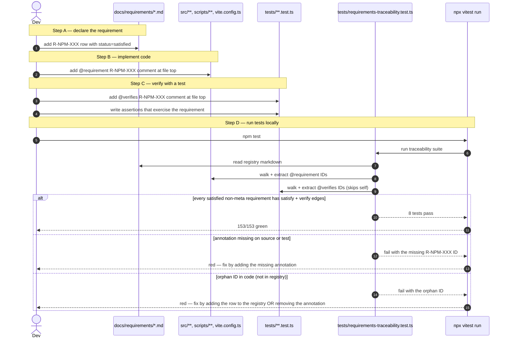
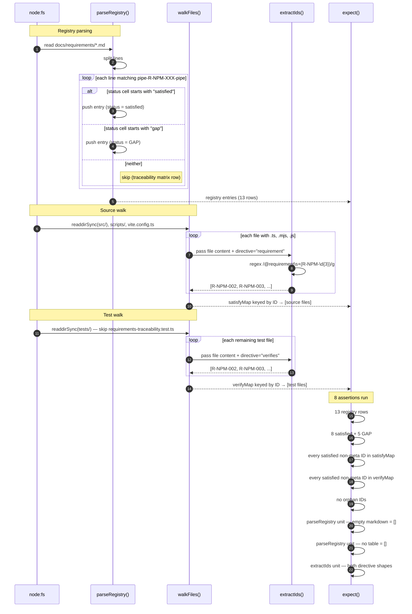

# Requirement diagram — `@thebassclef/core` npm distribution

## Purpose

This doc is the applied test case for the Traceability Subsystem promote at `docs/promotes/2026-08-11-traceability-subsystem.md`. It shows one adopter (bassclef-cli) using the proposed pattern end to end. Every acceptance item from the bet becomes a requirement with an ID. Every ADR, use case, decomposition, source file, and test file that supports that requirement lands as a linked node. Adopters and reviewers see the whole chain in one place.

No automation ships with this doc. Adopters walk the graph by eye. Phase 2 of the promote adds accessors and hooks that walk it for you.

## Sources read

- `docs/iteration-bets/2026-08-06b-launch-npm-thebassclef-core.md` L152-164 — the 13 acceptance items that become requirements.
- `docs/adrs/ADR-001..005-*.md` — technical decisions that derive from the requirements.
- `docs/use-cases/UC-init.md`, `UC-sync.md`, `UC-script-bump.md`, `UC-script-publish.md` — behavior specs that refine the requirements.
- `docs/decompositions/wu-1..5-*.md` — code-shape decompositions per WU.
- `docs/interaction-design/2026-08-08-npm-distribution.md` — arc-level state and sequence diagrams.
- `docs/publish-setup.md` — operator guide for the trusted-publisher setup.
- `src/**/*.ts`, `scripts/*.mjs`, `.github/workflows/publish.yml` — source files under the CLI + publish pipeline.
- `tests/*.test.ts` — 16 test files with 143 tests total (verified via `npx vitest run` on `feat/iter-b-drift-fix-pass` branch).

## Notation

SysML Requirement Diagram uses named relationships. This doc adopts five of them.

| Relationship | Meaning | Direction |
|---|---|---|
| «containment» | Parent requirement contains child | parent → child |
| «deriveReqt» | Technical requirement derived from a higher-level one (e.g., ADR from bet acceptance) | derived → source |
| «refine» | Design doc refines a requirement into a specification | doc → requirement |
| «satisfy» | Code satisfies a requirement | code → requirement |
| «verify» | Test verifies a requirement holds | test → requirement |

Requirement IDs follow `R-<domain>-<NNN>`. Domain is `NPM` for this bet's scope. IDs are stable across releases.

## Requirement registry

| ID | Title | Source | Status |
|---|---|---|---|
| R-NPM-001 | Repo scaffold shape — TypeScript + Vite + files whitelist + Apache-2.0 | bet L152 | satisfied |
| R-NPM-002 | `bassclef init` writes settings + config + manifest; idempotent | bet L153 | satisfied |
| R-NPM-003 | `bassclef sync` upgrades in place when a newer version publishes | bet L154 | satisfied |
| R-NPM-004 | Publish pipeline refuses `tier: upstream` files | bet L155 | satisfied |
| R-NPM-005 | Publish pipeline refuses operator-private terms | bet L156 | satisfied |
| R-NPM-006 | Publish uses trusted publisher; provenance auto-generated | bet L157 | satisfied (verified at first publish) |
| R-NPM-007 | Semver + changelog standards; closes ticket #3 | bet L158 | satisfied |
| R-NPM-008 | Cold-adopter harness gains npm-install-path check | bet L159 | GAP — upstream work |
| R-NPM-009 | Adam Sharpe security PRs — landed or deferred | bet L160 | GAP — deferred per bet L128 |
| R-NPM-010 | Sam demo — fresh machine → working bassclef in ≤ 5 minutes | bet L161 | GAP — needs live 0.0.2 |
| R-NPM-011 | First tagged 0.0.2 release published to npm | bet L162 | GAP — pending iteration e |
| R-NPM-012 | All Tier 0 tests GREEN | bet L163 | satisfied (143/143 local) |
| R-NPM-013 | `/architect-review` run at bet close; report merged | bet L164 | GAP — pending bet close |

Ratio: 8 satisfied, 5 gaps. `62%` complete against acceptance. Every gap traces to a specific iteration in the current plan.

## Traceability matrix

One row per requirement. Columns for derived_from (ADR), refined_by (UC + decomposition + design), satisfied_by (source), verified_by (test).

| Requirement | «deriveReqt» ADR | «refine» UC + design | «satisfy» source | «verify» tests |
|---|---|---|---|---|
| R-NPM-001 | ADR-001 | wu-1-repo-shape.md | `package.json`, `vite.config.ts`, `tsconfig.json`, `LICENSE` | `pack-no-source-maps.test.ts`, `template-version-lock.test.ts` |
| R-NPM-002 | ADR-002 | UC-init, wu-2-init.md, interaction-design | `src/commands/init.ts`, `src/commands/init-argv.ts`, `src/commands/init-templates/*.ts`, `src/lib/write-safely.ts`, `src/lib/resolve-target-dir.ts`, `src/lib/manifest-io.ts`, `src/lib/hash.ts` | `init.test.ts`, `init-argv.test.ts`, `should-refuse-root.test.ts`, `write-safely.test.ts`, `resolve-target-dir.test.ts`, `manifest-io.test.ts` |
| R-NPM-003 | ADR-003 | UC-sync, wu-3-sync.md, interaction-design | `src/commands/sync.ts`, `src/commands/sync-argv.ts`, `src/lib/hash.ts`, `src/lib/manifest-io.ts` | `sync.test.ts`, `hash.test.ts`, `manifest-io.test.ts`, `template-version-lock.test.ts` |
| R-NPM-004 | ADR-004 | UC-script-publish, wu-4-publish.md | `scripts/tier-filter.mjs`, `.github/workflows/publish.yml` | `tier-filter.test.ts`, `workflow-path.test.ts` |
| R-NPM-005 | ADR-004 | UC-script-publish, wu-4-publish.md | `scripts/andon-scan.mjs` | `andon-scan.test.ts` |
| R-NPM-006 | ADR-004 | UC-script-publish, `docs/publish-setup.md` | `.github/workflows/publish.yml` | `workflow-path.test.ts`, `validate-tag.test.ts` (partial — runtime verification at first publish) |
| R-NPM-007 | ADR-005 | UC-script-bump, wu-5-methodology.md, `standards/npm-versioning-and-changelog.md` | `scripts/bump-version.mjs`, `CHANGELOG.md` | `bump-version.test.ts` |
| R-NPM-008 | — | — (upstream) | — (upstream) | — (upstream) |
| R-NPM-009 | — (pending) | — (deferred) | — (deferred) | — (deferred) |
| R-NPM-010 | ADR-005 | interaction-design (Sam persona) | (future) demo recording + timing | (future) manual timing evidence |
| R-NPM-011 | ADR-004, ADR-005 | `docs/publish-setup.md` | (future) v0.0.2 tag + `npm publish` via workflow | (future) workflow-run + npm registry |
| R-NPM-012 | — | `.claude/rules/testing-tier-config.md` (bassclef substrate) | 16 test files | `npx vitest run` (local); CI check not yet wired |
| R-NPM-013 | — | `.claude/skills/architect-review/SKILL.md` (bassclef substrate) | (future) `/architect-review` dispatch | (future) architect-review output |

Confidence high on rows 1-7 (files verified on disk this session). Confidence lower on future rows 10-11 (satisfied_by is TBD by design — those requirements ship in later iterations).

## Requirement graph (SysML notation)

```mermaid
%%{init: {'flowchart': {'curve': 'linear'}}}%%
flowchart TB
  subgraph BET["Bet acceptance (bet L152-164)"]
    R001["R-NPM-001<br/>Repo scaffold"]
    R002["R-NPM-002<br/>bassclef init"]
    R003["R-NPM-003<br/>bassclef sync"]
    R004["R-NPM-004<br/>tier filter"]
    R005["R-NPM-005<br/>andon scan"]
    R006["R-NPM-006<br/>trusted publisher"]
    R007["R-NPM-007<br/>semver + changelog"]
    R008["R-NPM-008<br/>cold-adopter harness"]
    R009["R-NPM-009<br/>Sharpe security PRs"]
    R010["R-NPM-010<br/>Sam demo"]
    R011["R-NPM-011<br/>0.0.2 tag"]
    R012["R-NPM-012<br/>Tier 0 tests green"]
    R013["R-NPM-013<br/>architect-review"]
  end

  subgraph ADRS["ADRs (deriveReqt)"]
    ADR1["ADR-001<br/>build toolchain"]
    ADR2["ADR-002<br/>init safety"]
    ADR3["ADR-003<br/>sync safety"]
    ADR4["ADR-004<br/>publish pipeline"]
    ADR5["ADR-005<br/>two-road architecture"]
  end

  subgraph UCS["Use cases + design (refine)"]
    UCinit["UC-init"]
    UCsync["UC-sync"]
    UCbump["UC-script-bump"]
    UCpub["UC-script-publish"]
    IDD["interaction-design<br/>2026-08-08"]
    PUBSETUP["docs/publish-setup.md"]
  end

  subgraph SRC["Source (satisfy)"]
    CLI["src/cli.ts"]
    INIT["src/commands/init.ts"]
    SYNC["src/commands/sync.ts"]
    LIB["src/lib/*.ts"]
    TEMPLATES["src/commands/init-templates/*.ts"]
    BUMP["scripts/bump-version.mjs"]
    ANDON["scripts/andon-scan.mjs"]
    TIER["scripts/tier-filter.mjs"]
    TAG["scripts/validate-tag.mjs"]
    WF["publish.yml"]
    PKG["package.json + vite.config.ts"]
  end

  subgraph TESTS["Tests (verify)"]
    Tcli["cli.test.ts"]
    Tinit["init.test.ts + init-argv.test.ts + should-refuse-root.test.ts + resolve-target-dir.test.ts + write-safely.test.ts + manifest-io.test.ts"]
    Tsync["sync.test.ts + hash.test.ts + template-version-lock.test.ts"]
    Tbump["bump-version.test.ts"]
    Tandon["andon-scan.test.ts"]
    Ttier["tier-filter.test.ts"]
    Ttag["validate-tag.test.ts"]
    Twf["workflow-path.test.ts"]
    Tpack["pack-no-source-maps.test.ts"]
  end

  ADR1 -->|deriveReqt| R001
  ADR2 -->|deriveReqt| R002
  ADR3 -->|deriveReqt| R003
  ADR4 -->|deriveReqt| R004
  ADR4 -->|deriveReqt| R005
  ADR4 -->|deriveReqt| R006
  ADR4 -->|deriveReqt| R011
  ADR5 -->|deriveReqt| R007
  ADR5 -->|deriveReqt| R010
  ADR5 -->|deriveReqt| R011

  UCinit -->|refine| R002
  UCsync -->|refine| R003
  UCbump -->|refine| R007
  UCpub -->|refine| R004
  UCpub -->|refine| R005
  UCpub -->|refine| R006
  IDD -->|refine| R002
  IDD -->|refine| R003
  IDD -->|refine| R010
  PUBSETUP -->|refine| R006
  PUBSETUP -->|refine| R011

  PKG -->|satisfy| R001
  CLI -->|satisfy| R002
  CLI -->|satisfy| R003
  INIT -->|satisfy| R002
  TEMPLATES -->|satisfy| R002
  LIB -->|satisfy| R002
  LIB -->|satisfy| R003
  SYNC -->|satisfy| R003
  TIER -->|satisfy| R004
  WF -->|satisfy| R004
  ANDON -->|satisfy| R005
  WF -->|satisfy| R006
  BUMP -->|satisfy| R007

  Tpack -->|verify| R001
  Tinit -->|verify| R002
  Tsync -->|verify| R003
  Ttier -->|verify| R004
  Tandon -->|verify| R005
  Twf -->|verify| R006
  Ttag -->|verify| R006
  Tbump -->|verify| R007
  Tcli -->|verify| R002
  Tcli -->|verify| R003

  classDef gap fill:#ffe0e0,stroke:#cc0000,color:#000
  class R008,R009,R010,R011,R013 gap
```



## Sequence diagrams — enforcement

The static diagram sits above. Iteration d ships mechanical enforcement so the diagram stays honest as code evolves. Three views describe how the enforcement runs.

### View 1 — author flow

What a developer does to add or change a satisfied requirement, and how the test catches missing annotations.



### View 2 — test implementation

The algorithm inside `tests/requirements-traceability.test.ts`.



### View 3 — CI wiring

Where the test fires in the publish workflow.

```mermaid
sequenceDiagram
    autonumber
    actor Dev
    participant GitHub
    participant Checks as workflow — checks job
    participant Vitest as npm test
    participant TraceTest as requirements-traceability.test.ts
    participant Approver as Env approver
    participant Publish as workflow — publish job

    Dev->>GitHub: push commit OR create release tag
    GitHub->>Checks: trigger workflow (release or workflow_dispatch)

    Checks->>Checks: resolve-tag
    Checks->>Checks: checkout at tag
    Checks->>Checks: npm ci --ignore-scripts
    Checks->>Checks: validate-tag.mjs (semver + ancestor)
    Checks->>Checks: npm run build

    Note over Checks,TraceTest: Traceability enforcement fires here
    Checks->>Vitest: npm test
    Vitest->>TraceTest: run 8 traceability tests among 17 files
    alt all annotations complete + no orphans
        TraceTest-->>Vitest: pass
        Vitest-->>Checks: 153/153 pass
    else drift
        TraceTest-->>Vitest: fail with the missing or orphan ID
        Vitest-->>Checks: red
        Checks-->>GitHub: workflow red; nothing publishes
        GitHub-->>Dev: fix the annotation, push again
    end

    Checks->>Checks: npm run typecheck
    Checks->>Checks: npm pack --dry-run
    Checks->>Checks: andon-scan.mjs
    Checks->>Checks: tier-filter.mjs
    Note over Checks: checks job green

    Checks->>Approver: request npm-publish Environment approval
    Approver->>Approver: view check output on run page
    Approver->>Publish: click approve

    Publish->>Publish: re-checkout + install + build
    Publish->>Publish: npm publish --provenance --ignore-scripts
    Publish-->>Dev: step summary with npmjs.com URL + provenance
```

### What the diagrams do NOT show

- **Reverse impact analysis.** Phase 2 of the promote adds accessors that answer "I changed src/sync.ts — what breaks?" by walking edges. Today that walk is manual — read the traceability matrix column.
- **Diagram auto-regeneration.** The registry table is edited by hand. Iteration d does not automate diagram regeneration when new source files land.

## Gap analysis

Five requirements have no satisfier or verifier today. Each traces to a later iteration or an out-of-scope path.

| Gap | Cure | Owner |
|---|---|---|
| R-NPM-008 (cold-adopter harness check class) | bassclef-upstream Shape d work; not this repo | bassclef-upstream |
| R-NPM-009 (Adam Sharpe security PRs) | Reviewed + landed OR deferred with rationale per bet L127-128 | operator + Sharpe |
| R-NPM-010 (Sam demo timing) | Runs after 0.0.2 tags; iteration e output feeds R-NPM-010 | operator (demo run) |
| R-NPM-011 (first tagged 0.0.2 release) | Iteration e — needs trusted-publisher setup done out of band | operator |
| R-NPM-013 (architect-review at bet close) | Bet closeout — after WU-9 lands | operator |

Zero requirements have code without an ADR or design source. Zero requirements have a test without a satisfier. The chain is complete for the 8 satisfied rows.

## Composition with existing bassclef substrate

This doc uses substrate that already exists.

- **`.claude/rules/pattern-annotation.md`** — the precedent for the `@requirement` annotation the promote proposes. Same shape: a comment marker in the code files pointing at a catalog entry.
- **`.claude/rules/oo-ad-entry-point.md`** — the discipline that requires `/decompose` evidence before Construction. This doc extends that to require a requirement chain from bet acceptance through code and tests.
- **Frontmatter fields already used in this repo** — UC frontmatter already carries `references_adr` and `governs_source`. Decomposition frontmatter cites the bet. This doc's `references_luminaries`, `references_adrs`, and `promote` fields fit the same shape.
- **@luminary alexander-egyed** — real-time transitive consistency (proposed in the promote). This doc's mermaid graph makes the transitivity visible; Phase 2 of the promote adds the accessor + hook that walks it on Edit.
- **@luminary orlena-gotel** — pre vs post trace taxonomy. This doc is post-trace only (specification → code → deployment). Pre-trace (bet, canvas, ticket history) lives in the bet doc + the operator-private strategy doc `docs/operator-private/strategy/2026-07-26-kilo-port-npm-strategy.md`.

## Distinct from

- **This doc is not automation.** No script parses this file today. The Phase 2 accessor in the promote parses similar structure.
- **This doc is not a spec.** The ADRs are specs. This doc is a map that shows how ADRs, specs, code, and tests reference the requirements they derive from.
- **This doc is not a test.** The tests referenced in the traceability matrix are the actual verifiers. This doc catalogs which test verifies which requirement.

## Refs

- Traceability Subsystem promote: `docs/promotes/2026-08-11-traceability-subsystem.md`.
- Bet: `docs/iteration-bets/2026-08-06b-launch-npm-thebassclef-core.md` L152-164 (acceptance).
- Sister OOAD promotes at bassclef-upstream: #1167, #1168, #1169, #1170, #1171.
- Audit branch: `chore/ooad-audit-2026-08-11` (merged as PR #12) — surfaced 20 drift items.
- Iteration a: PR #11 (source-map safety, merged).
- Iteration b: PR #13 (13 drift fixes, merged).
- SysML Requirement Diagram — [OMG SysML 1.7 spec](https://www.omg.org/spec/SysML/1.7/).

## Update cadence

Refresh this doc when:

- A new bet acceptance item lands (add a row + graph node).
- A new ADR or UC ships (add the deriveReqt or refine edge).
- A new source file or test lands (update the satisfy or verify edge).
- A gap row closes (flip the status; document the closing iteration).

Phase 2 of the promote automates the refresh via a PreToolUse hook that rebuilds forward + reverse indexes on every Edit.
